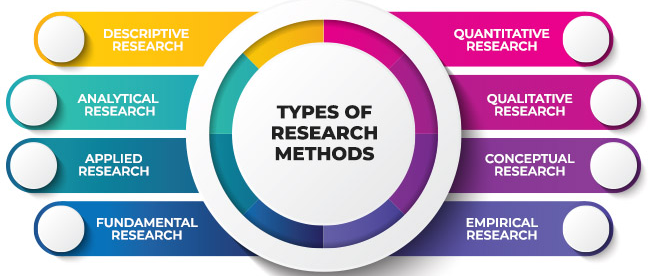

# Research to Market

### Research method

---

Introduction / Context :

When we need to add a task to our schedule, whether in a calendar or on our phone, we always do the same thing, and this can quickly become monotonous. To make this task more attractive, my aim was to transform the traditional cuckoo clock and reminder into a fully personalized smart calendar. In concrete terms, users will be able to enter their appointments via a website which, of course, is calendar-themed in the Warhammer 40,000 universe. This will enable them to organize their daily activities.

Who is this project aimed at? Of course, we're talking about fans of the Warhammer 40,000 universe, which boasts a community of between 30 and 50 million people. Just to give you an idea, let's say that a video game that has been awaited for 13 years has managed to reach 5 million sales. I'd like to remind you that just for one game among many others, 5 million people installed the game and studied the Warhammer lore. To tell you the Warhammer 40,000 lore comprises 1,097 works, including novels, short stories and collections. I'll stop talking about Warhammer 40,000, but you can see how well-developed and extremely well-constructed this universe is. My main idea was to integrate this universe in an immersive and captivating way! For an everyday experience, for example, instead of the traditional hourly birdsong, the user will hear an emblematic commissioner's voice line, taken directly from the Dawn of War game series. To remain faithful to my favorite games, I wanted to take up its principle, so that every interaction, such as adding an appointment or simply modifying one, becomes a unique experience.

A concrete scenario: Imagine a user standing in front of the revisited smart calendar. Upon detecting his presence, the eyes of the Astra Militarum emblem one of the most emblematic factions in Warhammer 40,000 light up red, accompanied by a vocal cue, but this time it's not the commissioner's voice you hear, but the machine's spirit speaking directly to you! This immersive setting aims to add a touch of detail, making everyday use of the smart calendar entertaining. 

What's more, when creating my website, I really wanted to make it as easy to use as possible. My main objective was to make it quick and easy to add an appointment. This ensured that my smart calendar would be most attractive to a wide range of users, from Warhammer enthusiasts to casual users and even the curious in search of new experiences. The aesthetic and sound aspects of my project, inspired by the world of Warhammer 40,000. allows me not only to add sentimental value for enthusiasts, but also to arouse the interest of a wider public, intrigued by novelty and originality. 

The last but not least, to enhance the user experience, the improvement I had in mind would be to add to the web interface a personalized choice of voice unit associated with each appointment. In this way, the user would no longer be limited to the curator's choices, but could select voice lines for iconic characters such as the Psyker, the Priest, the Assassin, or even iconic vehicles such as the Baneblade or the Leman Russ. Making every interaction as personalized as possible

---

Research question :

How does using React for the front-end and Node with Express for the back-end improve scalability and performance compared  than the current one used ?

---

Research method used :

