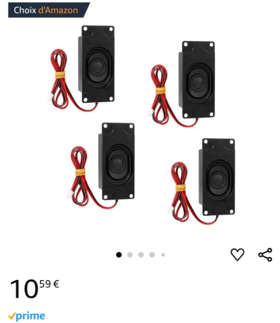
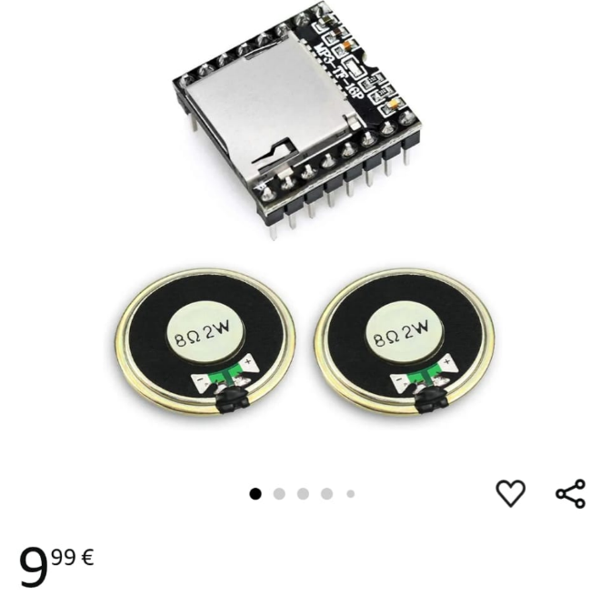
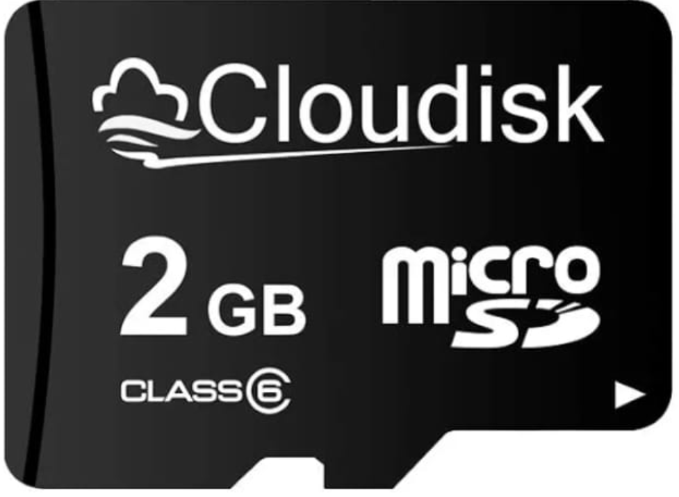

# 📜 Requirements

To build your embedded device, you need to have a clear idea of the requirements. On this page, you can describe the requirements of your embedded device. This includes the requirements from DLO, but also your own requirements.

Add some images! 😉

When I saw that I had no restrictions, whether for the machine we had to create or for the website, the first idea I wanted to implement was to put my favorite universe into my project. **Warhammer 40K** is an ultra-violent futuristic universe where warring factions (humans, aliens, demons) clash in a never-ending war, with a gothic, militaristic aesthetic. *“There's only war.”* And I thought, *OK, I want to implement that in my project, and if I could implement my favorite faction on top of that, then I'd never have the feeling of working because I know I'm going to enjoy doing it!*

When I read the plan for the intelligent calendar, I said to myself, *Eh, but actually, I could manage to implement the spirit of the machine with the voices of a commissioner and all. It was all a bit messy, but I knew I'd need loudspeakers in any case.*

---

## 🔊 First Choice: 8Ω Speaker

- Available on Amazon for **€10.59**

🔗 [View on Amazon](https://www.amazon.fr/Haut-Parleur-Fr%C3%A9quence-Ordinateur-Interface-JST-PH2-0/dp/B08QFTYB9Z/ref=sr_1_2)

---

## 🎵 Mini MP3 DFPlayer Module

To use multiple audio files, I needed a component that would allow me to play and manage them, so I opted for the **Mini MP3 DFPlayer Player Module**, which cost **€9.99**. The package also included **two extra speakers**, which I don't know how I'm going to use yet, but I've got two types if I want to.

🔗 [View on Amazon](https://www.amazon.fr/KeeYees-Lecteur-Bricolage-Compatible-Lautsprecher/dp/B07X2CZZDJ/ref=sr_1_5)

---

## 💾 SD Card

It's just a simple SD card that will allow me to store sounds. **€11.99**

🔗 [View on Amazon](https://www.amazon.fr/Cloudisk-2Pack-m%C3%A9moire-MicroSD-Classe/dp/B08L8T86TS/ref=sr_1_2_sspa)

---

## 🎒 Other Components

After selecting the rest of the components, I simply took them from the **kit I was able to buy from the school**.

- **Kit cost:** **€40**