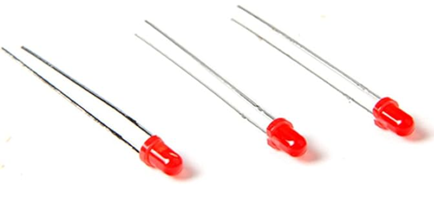
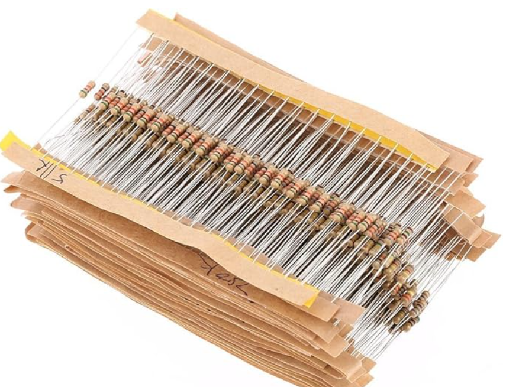
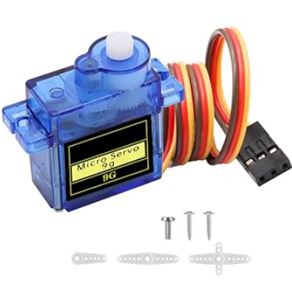
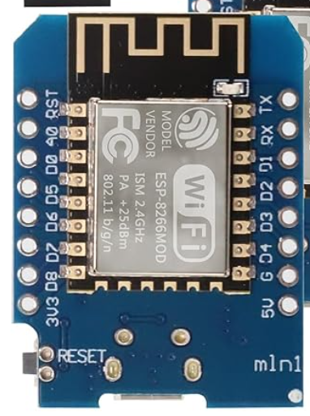
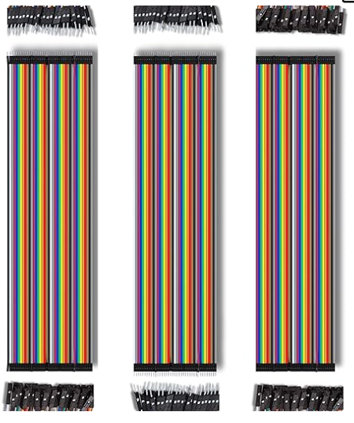
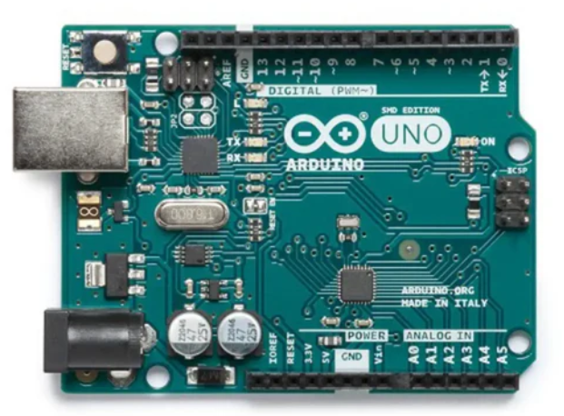

# 📜 Requirements

To build your embedded device, you need to have a clear idea of the requirements. On this page, you can describe the requirements of your embedded device. This includes the requirements from DLO, but also your own requirements.

Add some images! 😉

---

## 8Ω Speaker

- Available on Amazon for **10,59 €**

🔗 [View on Amazon](https://www.amazon.fr/Haut-Parleur-Fr%C3%A9quence-Ordinateur-Interface-JST-PH2-0/dp/B08QFTYB9Z/ref=sr_1_2)

---

## Mini MP3 DFPlayer Module

- Available on Amazon for **9,99 €**

🔗 [View on Amazon](https://www.amazon.fr/KeeYees-Lecteur-Bricolage-Compatible-Lautsprecher/dp/B07X2CZZDJ/ref=sr_1_5)

---

## SD Card

- Available on Amazon for **11,99 €** (3,00 € / unit) ( Just need 1 SD Card so 3,00 € )

🔗 [View on Amazon](https://www.amazon.fr/Cloudisk-2Pack-m%C3%A9moire-MicroSD-Classe/dp/B08L8T86TS/ref=sr_1_2_sspa)

---

## PIR Sensor

- Available on Amazon for **3,89 €**

🔗 [View on Amazon](https://www.amazon.fr/OcioDual-Mouvement-D%C3%A9tecteur-Pyro-%C3%A9lectrique-Infrarouge/dp/B071FBG4XW/ref=sr_1_7?__mk_fr_FR=%C3%85M%C3%85%C5%BD%C3%95%C3%91&crid=37D5E92SA78KY&dib=eyJ2IjoiMSJ9.ji4TkYx-ILjiTbmzr9509uM6_WhmYE9TNLFbMHPzvrQzuMGb0ZwrJy696_zo4z3F416-4RO7uRkQKqD3nhl2GdNJxXu3QVQSvaOjbfuGuiGreSNUo87tzdeZ7qZ_l-jPZbqfpUav0D4wMWzaZs_Qtamdy5UagQbFJ-slEky5VLemYL_0GctGqzmuALexSmUhSYVeIqH-YrMztXt8-_JafEO5obsu1Kboba7DAPXEacPCc-tEDzTWVSSXJnrdhA2BzMisl6mpFkjhII-6XmJaCcZgPxZc1ZxZkV45yGmYLlf8XQINfOQXbhTNOW16PhrKkVQOKF-Y_thcHXon1LACDamnzCS2DjQx2I1jSEG4wQTOZFnFj900HlHbrMOpDrdSjhmJm2MWuAVCCSUSAWs3vfVlDDG_WFffyS1XDcPNtAROV24u_dhYt1Lf4BOjvPve.FXhbDqtrSTx2zpFEmGyE2RXbmsUj0p-EuDVruLOg91Y&dib_tag=se&keywords=pir+sensor&qid=1739360437&sprefix=pir+sensor%2Caps%2C70&sr=8-7)

---

## 0.96” OLED display 128x64 I2C/SPI

- Available on Amazon for **6,89 €**

🔗 [View on Amazon](https://www.amazon.fr/dp/B0CX6HHW3D/ref=sspa_dk_bot_sx_aax_0?sp_csd=d2lkZ2V0TmFtZT1zcF9zZWFyY2hfZm9vdGVyX3NoYXJlZA&th=1)

---

## Red Led

- Available on Amazon for **5,75 €** (0,06 € / unit) ( Just need 2 LED so 0.12 € )

🔗 [View on Amazon](https://www.amazon.fr/100-LED-broches-Couleur-Lumi%C3%A8re-Arduino/dp/B00HD4P1XW/ref=sr_1_13?__mk_fr_FR=%C3%85M%C3%85%C5%BD%C3%95%C3%91&crid=1IWTV806UL8FZ&dib=eyJ2IjoiMSJ9.GcplxYdUiAMP0PzAwLaDBplF5qh2UYT-dsTI6UktUXhNNiJ5kju2CPYSUGhPl_DwTbot4pCN5Hs8amcbxiJbXsqxv34Wc37qUWsSKTvKSixQVmjPgetHV7QHR6PwjBaLgDaJ8VT_Jp44MR6V0lNGFY7o32D790He_G3e0B89tB_lsYZe3vFcFvHU8sYvL0kwogokXebtEYVPquUd8sewrWGZwxEWh0NAaBfee6WZjuNKcnN8hDV-4cgVWy3r94t9ElnxJMClqZpzXPgQj_pGGf8wH0AUKqh13GMpQ4XK-TIO991aqsB0b_XzMaJYaCUf66B50Pc-O8n1CWHjjrg8EWZW5Ap2L3Ri2oNDSlyE6SfE54Q7HnH56W962YzLXn3Oy1HmScmFLtNYVL3loY-XL_Z00LH7as1bf8bqrl_oumufO7U0KPX57sE6s-tThhxZ.JoO9mKoVVwHgxZhHcAao1TDq6OK2yB-y6o6t0HBntaE&dib_tag=se&keywords=led%2Barduino%2Bred&qid=1740699777&sprefix=led%2Barduino%2Bred%2Caps%2C66&sr=8-13&th=1)

---

## Resistor kit

- Available on Amazon for **6,99 €** (0,0125€ € / unit) ( Just need 4 resistors so 0,05€ € )

🔗 [View on Amazon](https://www.amazon.fr/DollaTek-R%C3%A9sistances-Carbone-Assorties-Valeurs/dp/B07DJ5644W/ref=sr_1_7?crid=23YMGMRNNAQ77&dib=eyJ2IjoiMSJ9.kZpp-ZUuTHqmqFu42-qVOJJg1qByfOGT0SW3cYOuiMitbvWQ7m6t23YUEU4yLbb2jYCiItBAZFGS7Qi5N8WjTkmJApejEBTD6iyR6NUeWDgJEgJtAzKQ-ybxwIRqfXjFpTrTdVrQY01Zj4yEY0JVQWYu-LUAjbE4JFPvB-ckVjq7jtRBv5LQUmJNG0I04EiZkT5WHIknu1oiNMiDRFCiBs4P6vkRBtJ1fhbtuG1LlcK7FemWCcMG0RneX_wzbOLVIZ108xQl_VYOnAcocwzQJg5C7vnopnkXB3-lUb7N-tcFHX5vm4gaNEHOuqFU8Aw3Ruyc6xVY-vDZb2WJAfXuMK97fPCctwc9ZjUKUCePT59NOOd9N10xj5KkcgXHzA1qrmLD_XJfMW3JNY-JIzn2eUGudGdH4e98kLju-ULqUATIMPhmQCXTcaGAVblPvfkm.kJ-bHCAWzp4l_vnsmwFNjjg56kyh0WFIuf8-hVjjvyo&dib_tag=se&keywords=resistor+kit&qid=1740700269&sprefix=resistor%2Caps%2C67&sr=8-7)

---

## Servomotor

- Available on Amazon for **10,99 €** (2,75 € / unit) ( Just need 1 Servomotor so 2,75 € )

🔗 [View on Amazon](https://www.amazon.fr/Servomoteur-Binghe-Servo-Micromoteurs-H%C3%A9licopt%C3%A8res/dp/B0DGT6SCLQ/ref=sr_1_6?__mk_fr_FR=%C3%85M%C3%85%C5%BD%C3%95%C3%91&crid=C59MZ7BK2RCZ&dib=eyJ2IjoiMSJ9.21GaGUINoApDqnIL7rbxeeIqh1tENdMwQFSwL4Yk-3Q7lCm4hT8I7vJuEikzQKk7ePKzaqhaduYhbTEcO-q_c1POaEkujY5c8WLvWTdiaJubohTSLYhEqybKxKApxXmH2vkXJ9svpxJ_WdaoPomXFF6hOBzxwRaHVFIOBX0my-YDLjp4k5iVfwbPwvSvSszXVCzvoWDwtE639jGGvgBF8bRdWoRopmS2oEckRJtpjJZnylT1l74sUjeWa92rgLgFkMQtLnMRb51XoHKyhL5JyR4kkdh601xqnwnlHN_jKMI5EchQWVRXCNs0AUt-5J8ZrH_u8l02xEK1QqycQrYIxG6jaqhXaDWEDBQXYHkO4IykcjCdtIFhEQsxA4MCAfTDUami_5OuEOF-O2r-3Q5g5dC3IOEAcadjjVOFhhCIwO1FWplSGRUIglR6yI_xR-dd.TXxUCNpjULbPLdT0mmXsnoU4aH2AAb0B2F16TluQwiY&dib_tag=se&keywords=servomoteur+arduino&qid=1740700622&sprefix=servomoteur+arduino%2Caps%2C62&sr=8-6)

---

## Wemos D1 Mini

- Available on Amazon for **9,99 €** (3,33 € / unit) ( Just need 1 Servomotor so 3,33 € )

🔗 [View on Amazon](https://www.amazon.fr/ESP8266-Binghe-d%C3%A9veloppement-Interface-Compatible/dp/B0D7C2WM9G/ref=sr_1_9?crid=WGNMI78IWOQC&dib=eyJ2IjoiMSJ9.RQgbe6NAUFT5c1TKFIbj4UguhvAN1R-f7Xe1Ntz74LPd8LINPKdWeZ4_yvBgwpMbd252Yf3OgLlzPznFCrJjOuh1yAwT15W6mI8XpODoHzH_2PHZ2oWTTi8stRAkgQ6uvnEhuqFFBNFynb_OoFJUjGRHEXUxe0RBapDG6C6_JAdsJs8dESQ_vMrHR3_KXK6xkGBazGhjEY63s0BBH3vUGRfYXIOXznBJoRe6ZcCMuFmgVI4nuqqj_IZCSysk48JMBpfC2EHC0KiOq_HRNC7amyzkpv-ZBmj9fXQmZLCP9uMYBZb7zmwoc_A_p8V5UtcAzbgAn7MrGXIsGYe4jSLZu-AyG9DNygzqou8IlGvMKsO27y7row52kfSaMbiXPZsLE6xFi9vV4N6Tqord-JB4nJ4baMslVemQS80_SQvSGKDuWOxXvkPgJ6lpDMSd1F6f.NjELVQ86RIYVD8uiLiwG4daLfGhzqlW1didRAhMDla8&dib_tag=se&keywords=wemos+d1+mini&qid=1740701171&sprefix=wemos%2Caps%2C102&sr=8-9)

---

## Wire

- Available on Amazon for **7,69 €** 

🔗 [View on Amazon](https://www.amazon.fr/AZDelivery-Jumper-Cavalier-C%C3%A2ble-Arduino/dp/B074P726ZR/ref=sr_1_1_sspa?__mk_fr_FR=%C3%85M%C3%85%C5%BD%C3%95%C3%91&crid=10LHWEAGO9O3L&dib=eyJ2IjoiMSJ9.pd2dzP-V48Zr44UXshWSV-qQYJ7xXcUm6GtWuK25WOR174g_gFwmatip78WkN_EbCwsqZC9BElgOOxJB8FGe2O1JVH7gyuzerPZMDGI94RfUBH8oVXOOuvl_nZlzJI7jOjuWou_8KNKcxZlzNoDlW8tuXBo4XvKBUC-N2xVEt1kHtxXfHE_-y7LgmHQ2kmel2BS2itbRJEtFCVXlspoEvBvso1SAwHH4osZzxiuVpI2QiAtz1rxnQ7V4n7Ndi9Q0LItNvik_nYP9J1DWyJpSAPLhswLhS6VK4VcZq7gzCAI.6DhEkVczgK3DIN0xBOUlJUK6YpavQX45_xglLuHkwew&dib_tag=se&keywords=wire%2Barduino&qid=1740701057&sprefix=wire%2Barduino%2Caps%2C68&sr=8-1-spons&sp_csd=d2lkZ2V0TmFtZT1zcF9hdGY&th=1)

---

## Wire

- Available on Amazon for **26,21 €** 

🔗 [View on RobotShop](https://eu.robotshop.com/nl/products/arduino-uno-rev3-smd)

---

## Total  

- **89,41 €** 