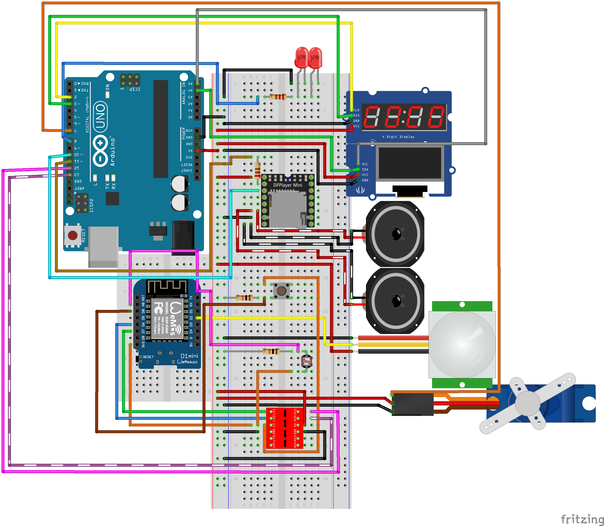

# Technical documentation

Your Wiring Diagram, Bill of Materials, ... everything about how you built your embedded device should be documented here.

## **Wiring Diagram**

This Fritzing diagram shows the wiring of the ESP32-based Smart Calendar system. It includes the connection of several hardware components: an I2C LCD, a 7-segment display (TM1637), a DFPlayer Mini audio module, a servo motor, a PIR sensor, a brightness sensor (LDR), and a push-button. The aim is to visualize the project's physical architecture in order to facilitate assembly.

---

## ESP32 ( Inputs )

__Button :__

Connected to PIN D14

VCC : 3.3 V

Resistance of 10k Ohm

__Photoresistor :__

Connected to PIN D34

VCC : 3.3 V

Resistance of 10k Ohm

__PIR Sensor:__

Connected to PIN D35

VCC : 5 V

---

## ESP32 ( Outputs )

__4 digits display :__

Connected to PIN D18 **CLK**

Connected to PIN D19 **DIO**

VCC : 3.3 V

__SV90 Servo :__

Connected to PIN D27

VCC : 5 V

__LCD Screen :__ 

Connected to PIN D22 **SCL**

Connected to PIN D21 **SDA**

VCC : 5 V

__DF Player Mini :__

Connected to PIN RX2 **TX**

Connected to PIN TX2 **RX**

VCC : 5 V

Resistance of 10k Ohm for **RX**

__Speaker :__

Connected to PIN SPK_1 **on DF Player mini**

Connected to PIN SPK_2 **on DF Player mini**

---

## **Bill of Materials**

This table lists all the components required to build the ESP32-based Smart Calendar System. Each item includes a description, the quantity used in the project, the estimated price (including VAT), and a link to an example supplier. These components provide the system's main functions: display, sensor reading, network communication and user interaction.

| Part #         | Manufacturer   | Description                            | Qty     | Price    | Subtotal | Example URL                                                                                                                      | Extra Info                                                      |
|----------------|----------------|----------------------------------------|---------|----------|----------|----------------------------------------------------------------------------------------------------------------------------------|------------------------------------------------------------------|
| ESP32-DEV      | Espressif      | ESP32 dev board WiFi/Bluetooth         | 1       | 9.00 €   | 9.00 €   | [Link](https://www.tinytronics.nl/en/development-boards/microcontroller-boards/with-wi-fi/esp32-wifi-and-bluetooth-board-cp2102) | [Datasheet](https://www.espressif.com/sites/default/files/documentation/esp32_datasheet_en.pdf) |
| TACT-6x6x5     | Not specified  | Tactile push button (momentary)        | 1       | 0.10 €   | 0.10 €   | [Link](https://www.tinytronics.nl/en/switches/manual-switches/pcb-switches/tactile-push-button-switch-momentary-4pin-6*6*5mm)   | [Datasheet](https://www.vishay.com/docs/28729/cfrc.pdf)                                  |
| GL5528-LDR     | Not specified  | Light dependent resistor (LDR)         | 1       | 0.30 €   | 0.30 €   | [Link](https://www.tinytronics.nl/en/sensors/optical/light-and-color/gl5528-ldr-light-sensitive-resistor)                       | [Datasheet](https://components101.com/sites/default/files/component_datasheet/LDR%20Datasheet.pdf)                                          |
| PIR-HC-SR501   | Not specified  | PIR motion sensor module               | 1       | 3.50 €   | 3.50 €   | [Link](https://www.tinytronics.nl/en/sensors/motion/ir-pyroelectric-infrared-pir-motion-sensing-detector-module)                | [Datasheet](https://cdn-learn.adafruit.com/downloads/pdf/pir-passive-infrared-proximity-motion-sensor.pdf)                                  |
| 4SEG-COM-RED   | Not specified  | 4-digit 7-segment display (red)        | 1       | 1.25 €   | 1.25 €   | [Link](https://www.tinytronics.nl/en/displays/segments/segmenten-display-4-characters-red)                                       | [Datasheet](https://www.vishay.com/docs/28729/cfrc.pdf)                                     |
| SG90           | TianKongRC     | SG90 Mini Servo                        | 1       | 3.25 €   | 3.25 €   | [Link](https://www.tinytronics.nl/en/mechanics-and-actuators/motors/servomotors/sg90-mini-servo)                                 | [Datasheet](https://www.vishay.com/docs/28729/cfrc.pdf)                                               |
| LCD-16x2-BL    | Not specified  | LCD 16x2 blue backlight display        | 1       | 3.50 €   | 3.50 €   | [Link](https://www.tinytronics.nl/en/displays/lcd/lcd-display-16*2-characters-with-white-text-and-blue-backlight)               | [Datasheet](https://www.vishay.com/docs/28729/cfrc.pdf)                                     |
| DFPlayerMini   | DFRobot        | Mini MP3 Player Module                 | 1       | 8.00 €   | 8.00 €   | [Link](https://www.tinytronics.nl/en/audio/audio-sources/dfrobot-dfplayer-mini-mp3-module)                                       | [Datasheet](https://www.vishay.com/docs/28729/cfrc.pdf)                                   |
| WS-14595       | Waveshare      | Speaker set - 8Ω 5W                    | 1       | 6.75 €   | 6.75 €   | [Link](https://www.tinytronics.nl/en/audio/speakers/speakers/waveshare-speaker-set-8%CF%89-5w)                                   | [Datasheet](https://www.vishay.com/docs/28729/cfrc.pdf)                                              |
| BB-170-WHITE   | Not specified  | Breadboard 170 points (white)          | 2       | 1.00 €   | 2.00 €   | [Link](https://www.tinytronics.nl/en/tools-and-mounting/prototyping-supplies/breadboards/breadboard-170-points-white)           | [Datasheet](https://www.vishay.com/docs/28729/cfrc.pdf)                                      |
| BB-PWR-3.3V-5V | Not specified  | Breadboard power supply                | 1       | 2.50 €   | 2.50 €   | [Link](https://www.tinytronics.nl/en/power/voltage-converters/voltage-regulators/breadboard-power-supply-5v-en-3.3v)            | [Datasheet](https://www.vishay.com/docs/28729/cfrc.pdf)                                    |
| DUP-MF-10CM    | Not specified  | Jumper wire M-F 10cm (x10)             | 2 packs | 0.50 €   | 1.00 €   | [Link](https://www.tinytronics.nl/en/cables-and-connectors/cables-and-adapters/prototyping-wires/dupont-compatible-and-jumper/dupont-jumper-wire-male-female-10cm-10-wires) | [datasheet](https://example.com/10k_resistor_datasheet.pdf)                                               |
| DUP-MM-10CM    | Not specified  | Jumper wire M-M 10cm (x10)             | 2 packs | 0.50 €   | 1.00 €   | [Link](https://www.tinytronics.nl/en/cables-and-connectors/cables-and-adapters/prototyping-wires/dupont-compatible-and-jumper/dupont-jumper-wire-male-male-10cm-10-wires)   | [datasheet](https://example.com/10k_resistor_datasheet.pdf)                                               |
| RES-10K-5%     | Not specified  | 10kΩ Resistor (±5%)                    | 2       | 0.05 €   | 0.10 €   | [Link](https://www.tinytronics.nl/en/components/resistors/resistors/10k%CF%89-resistor-(standard-pull-up-or-pull-down-resistor)) | [Datasheet](https://www.vishay.com/docs/28729/cfrc.pdf)        |

### Total ≈ 56.95 €