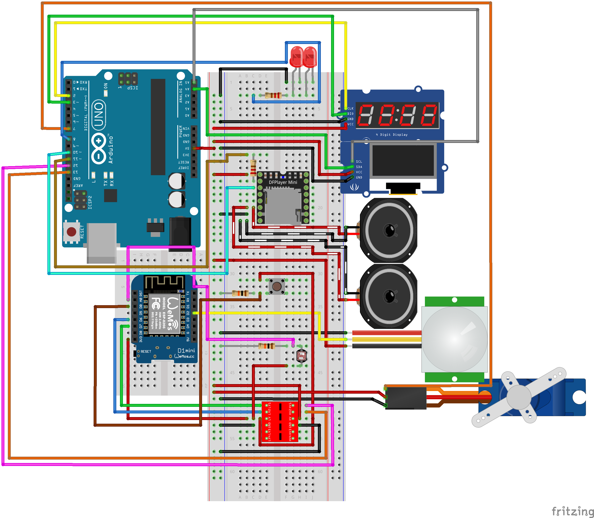

# Technical documentation

Your Wiring Diagram, Bill of Materials, ... everything about how you built your embedded device should be documented here.

As I have a few basic arduino connections, I started by connecting the simplest things for me, i.e. the basic connections to the LEDs and the servo motor were uncomplicated. For the wemos, the PIR sensor, the Mini MP3 DFPlayer Player Module and the speakers, I had to look at the documentation for each component to understand how to use them and, above all, how to connect them. I asked in my feeds backs to see if I'd made any silly mistakes or forgotten anything. I'd like to thank Nicolas for telling me to try and color-code the components so I could find them at a glance. 

Pir Sensor: I wanted a component that would allow me to detect the presence of a person

Wemos D1 mini: I don't really have a choice, as this will enable me to collect information from a cloud via APIs

SV90 Servo: I needed a motor that would allow me to translate my “cuckoo clock”, so I decided to get a servo motor

DFRobot DFPlayer Mini: This lets me manage my audio files, choosing when I want a specific file to play. With the help of an SD card, so I can store more than one file

Buttons : When the user presses the button, the device switches between English and French

Led: Switching on and off 

Speaker: This will allow me to play a sound

Photoresistor: Detects whether the device is in the dark; if it is, it switches to silent mode if the user wants to go to sleep.

Oled display : It's purely for the “beauty” of my project, it's just to support my universe. I wanted to have a compositor that would allow me to simulate the impulses of a heart, to pretend that the machine's mind was in my intelligent calendar

Arduino: It is the centerpiece of my project, it is the one that will receive all the programs that I need to create