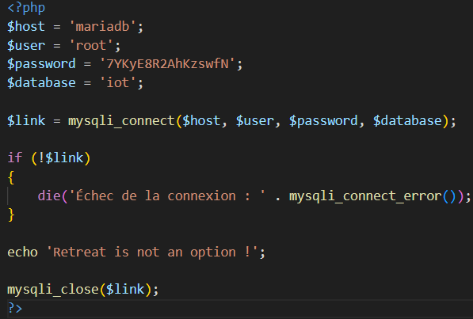
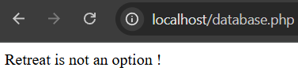
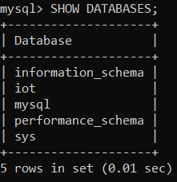
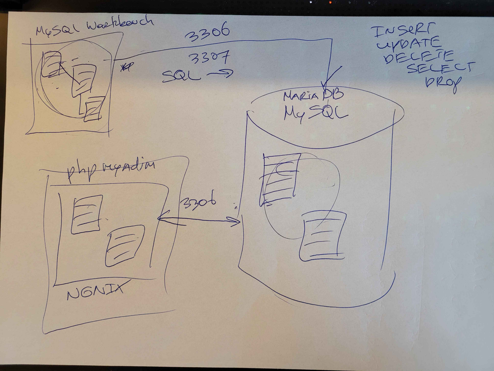

# Learning journal

Your learning journal can be seen as a diary of your learning process. It is a place where you can reflect on your learning, and where you can keep track of your progress. It is also a place where you can keep track of your questions, and where you can write down your answers to those questions.

So for example when you receive feedback on your project, you can write down the feedback and your reflection on it in your learning journal. You can also write down what you have learned from the feedback, and how you will apply it in your project.

## Seventh week

### Monday 17/03

---

## Sixth week

## Friday 14/03

I failed, yesterday I couldn't do the programs I wanted to do, I had a lot of problems with the connection between the Arduino and the Wemos, I tried everything but I even got some help from Indigo who gave me some components to be able to do it, last week it was a Friday if I remember correctly he came to help me for more than 2 hours. I went over his Frietzing file with him, I went over his code with him and we modified everything, and even with that he told me that the configuration we'd managed to make was that only the wemos could send data, but that the arduino couldn't send any. In itself, I don't have a problem with that, because that's how I want it done.

That's why this week I've started all over again with my connection part, but I've found a solution which is just to buy an ESP32. Which I've done, I should receive it tomorrow, and as I'm going back to France today I'll be able to pick up the components I need. I ordered an LCD screen and an ESP32 for all my connections.

## Thursday 13/03

It's 3:00 AM as I write this leaning journal, I've been working on the part of the code that would allow me to control the connected outputs of my arduino board from my Wemos, but what I don't understand is why I can't do it. At first I thought it was a connection problem, but then I went back and reconnected what I thought was a potential problem. I ran tests to check every output without going through wemos because I thought it was a pin problem in the code or something.
The craziest thing is that it works, I can send data but I don't understand why I can only do it once, at least I know it's a code problem and not a problem with what I've plugged in.

I've got to get some sleep, I need to rest so I can work on finding the problem tomorrow, or at least in a few hours.

I spent a lot of hours trying to send specific data to my Arduino, but I don't know why it didn't work... I replaced my jumper wires. I tried to begin and restart all my programs to try to solve it, but even if I met a lot of problems, I know all my programs are working separately and the only solution I found is to buy an ESP32. I already received it but to my home. I did a lot of research to see if I could connect all my components to the ESP32 and, if I'm right, it should work because the problem with sending data to the Arduino from the Wemos will disappear. 

## Wenesday 12/03

On Monday I redid all my embedded devices, i.e. I started from scratch all my connections for my components, I completely rechanged all my inputs and outputs. It took me all day, but I did it. I'm not going to go into detail again, because I've already done that, but what I mean by that is that every day I have some kind of big “theme”.

Monday Embedded device

Tuesday Database

Wednesday Documentation

Thursday Code to communicate with the arduino via wemos

So today I went back to my System Architecture section and tried to add everything in it to keep it up to date, as our teacher had asked us to do. Hoping I've filled it in properly, I went back to my requirements documentation and added the latest components I've decided to use. For my embedded technical documentation, I rearranged everything to explain each component and the pins it uses. As for my technical documentation for the web part, I explained each page with what users can do. And for my database, I've added a criticism I noticed. 

### Tuesday 11/03

After finishing all the connection work, I started the day by working on my Database Schema. Today I wanted to finish all my database stuff, whether it was to be able to send, receive or delete data in my database. I'll go into more detail today. I wanted to modify some data on my Data Schema to make my life easier, whether to add or delete data, so I had to make the changes. For example, for the component names, I had set 255 when it wasn't really very consistent, so I modified my tables to ensure that there was a real dependency between the tables, e.g. if you delete the Sensor table, the SensorData table is automatically deleted because the sensor data depends on the sensors, and I did the same for the Device and Appointment tables.
Changes to the Database Schema inevitably mean changes to the ERD schema, and that's what I did, making the necessary changes to ensure consistency between the 2 schemas.

I wanted to start by adding my wemos to my database because in my schema it's my key component, if this component isn't there, the table doesn't exist and if this table doesn't exist nothing can be added, I wanted to check that my appointments were sending information to the wemos using the wemos ID and everything worked fine, I didn't need to make any changes.

After successfully connecting my wemos to my database, I had to send a first sensor to my database. I decided to use the button because it's really easy to use. Once I'd managed to connect my button to my database, I had to manage to send data to it, so I took the position of the button and made sure that as soon as the button was pressed, it was sent to the database. 

I'd already started yesterday, but I wanted to send data to my arduino board via my wemos, so I started with a simple test: manage to turn the LED on or off using the button connected to my wemos, which I managed to do easily and without too many problems. When I tried to do the same thing with the DF Player mini, it was immediately more complicated, because when I tried to send data to the arduino board, my DF Player mini was no longer detected at all. I carried out various tests and thought to myself that it was the DF Player that had blown up, so I had to run it unintentionally, and I'll have to buy another one. I ran a simple program just to launch an audio file on the SD card and it worked normally. I knew that the wemos could communicate with the arduino board because I was able to control the led with the button, I knew that the DF Player mini worked normally. There was only one way to tell that something was wrong, and that was that the arduino board wasn't able to launch an audio file and receive commands from the wemos. It had to be done in 2 steps, and it took me a long time to realize that the arduino board wasn't capable of doing both things at the same time, but that it had to be done in 2 steps, so I started programming a code to actually take the orders given by the wemos and then execute them, and not do both. But I know I've got some errors in my code that I'll have to go back to. 

After making progress but not finishing the part I wanted to do, because I'm still encountering problems that I'm going to sort out on Thursday I added the latest sensors, for the PIR Sensor I wrote a program that lets me enter the sensor manually because that part I can't manage automatically as for the sensor type. Incrementing the ID is done automatically. I used the same principle for my latest sensor, the photo resistance.

When I added a sensor, a device or data, I had to have a way of checking that what I'd added was actually in my database. So I had to create 3 recover files for my device, my sensors and of course my data. And since they have to be put in a JSON file, I just followed the instructions and put them in a JSON file.

I ended my day by writing programs that allowed me to delete a device, for example in my case the wemos, as I've modified my database so that when I delete the device, it automatically deletes the Sensor table and the SensorData if there's no longer a device in the table. The same goes for the Sensor, if I decide to delete a sensor it works normally, but if I no longer have a sensor in the table it deletes the SensorData table. And for the last table, if I need to delete a piece of data, there's no problem, even if I delete all the data in the table, it won't affect the other tables.

### Monday 10/03

Today I decided to go back to my embedded system and redo everything from scratch, I had to change my approach because I was missing some pins and my goal is to succeed in putting all the inputs on my wemos and all the outputs on my arduino board. Today I enlisted the help of Indigo, who gave me a lot of help with this part of the project. It took me the whole morning and afternoon to get it working. I started by connecting all my inputs, including my PIR sensor, the photoresistor and my button. Then I finished with my part with the various outputs. Which I did when I got home and did all my Frietzing part, which took me a long time, but tomorrow I'm going to keep working. I've set myself the goal of finishing all the embedded part today, all the connection part tomorrow, and after tomorrow all the data sending part between the wemos and my arduino board. 

---

## Fith week

## Friday 07/03

Today I went to see Mats to talk to him about my problems, what was too weird was when I put the local host to see the devices I had in my database. Before dealing with the loss of the connection, I wanted to make sure I could recover the device ids I'd already created, so I started by creating a recover device file that would allow me to just recover the devices I had in my database. I'd already created a device for the test device because I needed one to be able to add or delete appointments on my database. So after creating it, I did a “classic” test just by putting the link on the Internet and adding localhost without my IP address. I wanted to try again, the experience with my IP address where I had problems, I wanted to show my problems to Mats to show him my problems to my great surprise everything worked normally. I was really surprised and I was a man with more questions than before. I explained everything to Mats, from what I understood it was the fact that I was in my home network that was blocking my connection.
After the explanations I understood that I had to make a tunnel for it to work. Or use my phone's connection to make it work, but now I'll be able to go ahead and finish my embedded device part, my database part and send data to my database.

## Thursday 06/03

( Probably between 00h00 and 4h in the morning )
So I started by connecting all my first part which was to connect the easiest that is to say the LEDs to my wemos, although the LEDs do not send things to the wemos they can receive, my goal is to succeed in making when a person passes by that it can light.
The second component I connected was the button. I'd like to make it so that when someone presses it, it plays a game like my Dawn of War game, because anyone who's ever played that game knows how much the characters talk in it.
The PIR sensor to have a person detector to turn on the LEDs and play a sound when a person is in front of the smart calendar.
I wanted to connect my DF player but for some reason I'm having too many problems connecting it and I can't figure out why it's not working...

( 10h20 - 15h20 )
I started my day by wanting to continue to solve my DF Player mini problem but I'm still having problems. I wanted to restore my PIR sensor but for some reason it doesn't work anymore and I'm having the same problems as yesterday which is that it keeps showing me that a movement is detected when it's not.
I've connected the screen that allows me to display the heartbeat simulation to my arduous card.

(16h00 - 2h00)
As soon as I got home I set to work to make the best progress I could but for some reason my port 80 has a problem, I really don't know what to do to fix it I saw on the internet that you could change the port but being far from a pro I prefer to stop for today and ask Mats if he could give me a hand...

## Wenesday 05/03

Today I decided to work on the wemos connectivity part, I wanted to make myself a little schedule for the day to enable me to connect the wemos to my database, the first code I wrote allows me to retrieve the IP address of the wemos, I'll have to find a solution to manage to put it in a JSON file with its ID and IP address. 
I've found some videos explaining the different connections I could use, because I need to re-adapt the whole embedded device part for simplicity's sake, because putting all my sensors on the Wemos will enable me to access them more easily, whereas on the arduino board as I was planning to do, I could have encountered a lot of difficulties. So my goal for tonight is to redo the whole embedded device part, and if I make good and rapid progress I'll be able to finish it tonight. I don't know what time I'll go to bed, but in any case here's my plan for tonight.

## Tuesday 04/03

Today I spent the whole day dealing with one thing and that's connecting my website to my database, yesterday I'd managed to send an appointment to my database, the next step I had to take was to delete, modify and retrieve all the appointments in a JSON file. I started by learning about the API part, from what I found in the video a friend had given me. I needed an API for an “action”, so I created a delete, insert, update and recover. Then I saw in the assignments what was needed to have the above exceptation, so I spent the whole day doing that. To be able to display the add part correctly, for example, I had to create an API that would allow me to recover only the last appointment I'd added, by creating get_last_appointment.php with sceens shots. For proof of all this, I invite you to see my https://buudiizaaduu29-e0e00a.dev.hihva.nl/web/api_reference/. 
You'll be able to see everything I did for a whole day

## Monday 03/03

Today I've decided not to give up. Retreat is not an option! I started my day by reworking my data schema with the right conventions to redo the forward engineer and send it back to my database. I had a hard time understanding that I had to make all the attributes visible, but I admit I still don't understand why I had to do that.
Once my database was perfect, I took care of everything at once. In a youtube video, it was said that you had to create a php file for each major part of your code, i.e. what you wanted to do, e.g. if you wanted to add or delete an appointment, you had to create 2 and not put both in the same file. I created all the files I thought would be useful for my project, and the first thing I did was to add an appointment to my database. After 3 hours, I remembered that I'd set devide_id as a foreign key, and that if my device_id wasn't created, I couldn't add an appointment... It was a very sad moment
I manually created a test device with a random IP address with an SQL query to test my site, I was able to add one, then I added delete an appointment to be able to change it. 

---

## Fourth week

## Friday 28/02

### By the emperor it will be done ! 

Finally, I succeeded (with the help of Yanis) my mistake was not to put the right name of the database, I spent so much time yesterday looking everywhere how to connect it. It was just the name, I want to smash everything !

## Thursday 27/02

Today I wasn't able to work on what I wanted to do, the teacher asked us to do a presentation on the front end, back end and database part. It's true that I learned a lot, but I must admit that I would have preferred to move on to what I really wanted to do, i.e. the connectivity part for my wemos and my website. It's really this part where I'm treading more on unfamiliar ground. Today I reread the feedback I'd received and saw that I had quite a few things to redo, which is what I did today. I had to redo my entire System architecture part, because the visibility wasn't up to scratch, and I also had to redo the text part because I'd missed some important information. As for the database part, it was Professor Mats (I hope I didn't misspell his first name...) who told us to be careful to justify our various choices, so I decided to take his advice and apply it to make it a priority. When my friend asked me what I thought of his requirement, he explained that it had to be well detailed so that if one day someone wanted to take over our project, he could deal with it easily. I went back to my requirement and completed it as best I could.

I've managed to access my database on my terminal, but I don't understand why I can't access it with my website. For some reason I'm completely stuck on this part, I don't know what to do even though I've watched the videos I wanted to see. I'm going to watch them again and ask for help with this part because I'm really struggling.

## Wednesday 26/02

Today I spoke to my teacher about my problems and he tried to help me. I still don't understand why I'm having these problems, but there's no question of withdrawing. I'm going to keep looking and finding a solution. I've tried changing all my cables, changing my speakers, changing the format of the audio files, changing the size of the files, I've tried everything and I don't know why I can't manage it, I'll try to sort it out next time maybe tomorrow or maybe not, I don't really know if I'm behind or if I'm on schedule with the project.
I decided to use a screen to display a simulated heartbeat to emphasize the machine-like aspect of my project. 
Unfortunately, the teacher didn't have a backpack to give me, so I wanted to connect the screen we'd been given to display the various tasks the user would be entering.
I wanted to go ahead and connect a 7-segment display to have a way of showing the time in real time, but I'm running out of space on my arduino board.
So instead I've decided to continue connecting my wires with a good “presentation” so that it's clearly visible, and I'm going to ask for feedback on this to see what they think. 
Today the teacher reminded us not to forget to add what we're doing on our System Architecture, so that's why I did it

## Tuesday 25/02

Today I really wanted to get my DFPlayer Mini working with my speakers, I finally managed to see about my resistors, thanks to my friends they helped me identify them properly because I have problems with some colors but with the right resistors I managed to get it working! I'm so happy that my DFPlayer Mini is working, I had a lot of problems with the “listing” part of my audio files. I had to rename them all, which took a bit of time, but I had no choice, because when I put in the 2nd audio file, it put me in the 20th. But now I'm running into a problem that I don't understand at all: when I change the file I'm compiling, it gives me saturations, whereas when I unplug and plug in my arduino board with the program already on it, it runs without saturation. I'm going to see the teacher tomorrow so he can give me a hand to understand all this

## Monday 24/02

Today I started my day early because my girlfriend is still here, she's leaving on Wednesday, which is why today I'm working in the morning as opposed to my habit of working late into the evening. This morning, someone in class had sent me a youtube link https://youtu.be/VnfX9YJbaU8?si=uhN22vAEtGgXQCOh I watched it to understand the whole connectivity part, I admit I have a lot of trouble with this part and it's the part that scares me the most...
While surfing the web I found the video I needed to learn how to connect my website to my database ! https://youtu.be/tHKsZdS8Oug?si=_tlX0Q8mqJxHsq8b
During the course I had my first lesson on the laser cutter, that we had programs that were already pre-made to help us, that we could customize infi because each line and each cut had its own parameter. That the cutting order was obviously important, and that we were even entitled to a board to help us set the right parameters for speed and distance. So I started thinking about how I was going to make my real final product. The laser cutter or the 3D printer, knowing that at our school we have 5 3D printers, and that I know I want to make something really in line with my theme, so I decided to go for the 3D printer, I did a lot of research to see what model I could use, and luckily found lots. There's a box I found that I'm going to use as a starting point and I'm going to change all the desuss elements to make a box that goes well with my theme.

---

## Third week ( Holiday )

## Thursday 20/02

Today was mainly the test phase, and although I was on vacation with my girlfriend, we took some time to work separately. For the construction part, I was disappointed to see that I'd made 2 very stupid mistakes concerning my LEDs: I'd reversed the anodes and catodes... I was able to run 2 test programs, one that lets me test my LEDs to see if everything's working properly, and the other my PIR sensor. In both cases, everything's working perfectly, so tomorrow I'll continue working on my real model and finally test my loudspeakers. 

## Tuesday 18/02

So today I didn't do much work because my girlfriend came to see me during the vacations, but today I really wanted to add my requirements section because I know that if I don't do it now I'll forget to do it. I sent my file with the audio files to her PC because for some reason my computer, which cost me over 1600 euros, doesn't have an SD drive, whereas hers does, so I sent her my audio files so she could put them on my SD card. And tomorrow I'm going to start assembling my components together and start coding on my arduino.

## Monday 17/02

I started my day by improving the layout of my cables to have a better view of my components and especially because I plan to add other components like a screen that I'll try to add tomorrow. I took care of my website to put a loading screen because my girlfriend had sent me a Tik Tok link to show me that there was a site that would allow me to add loading screens “easily”. The site is https://uiball.com/ldrs/.
But the problem with this site is that it took me at least 1h30 to reconfigure everything because the installation was a real pain to do. I wasted way too much time doing it. But now I'm happy, I've got a really nice site that I find really beautiful. I'll be asking for feedback next week. I tried to connect my website to my database but I lack the knowledge to do this part. I've tried everything I can but for some reason I just can't do it. But I'll keep checking tomorrow, I'll finally be able to start building my project, because last week I had to wait for my father to bring me the components I wanted and now I have to wait for my girlfriend to arrive because on her computer she has an SD card reader whereas on mine I don't have one.

---

## Second Week

## Friday 14/02
So today, I continued to work on the database part, I made some modifications that Mats had told me to make, I'm thinking particularly of the primary key, the indexes to foreign keys... I uploaded some files that weren't right, and improved some aspects of my planning. Oh yes, and I saw my mentor for the first time, or my coach, I forget which role he's affiliated with. I'm glad I managed to get Above Expectation, I imagine he was pleased with my work.

## Thursday 13/02

I'd like to thank Professor Mats most of all, who more than helped me connect my mysql Workbrench to my database. I learned so many things at once and I'm happy because now I know how to do it and I know I could help my friends to solve this problem. First we need to connect with our account and that will give us the right ports and ip address. I didn't manage to do this last night, which is why I didn't stay up too late because I was blocked. Then the advantage I had was that all I had to do was retrieve my schema and with a few clicks (although I realised that I'd misconfigured my tables because you always have to reselect whether it's for the index, for foreign keys, etc.), I was able to create my own schema. And by doing all that, it works. Thanks again to Mats and Gerald (I hope I didn't misspell his first name) for helping me.

## Wednesday 12/02
  - Today I reread all my database courses because I'd completely forgotten how to represent entities with links. I learnt a new way of representing them with our teacher, who used to put ( 1, N ), well numbers and letters and not just bars. I've added some documentation because last night I didn't have time to do it, I've replaced an audio file that wasn't cut up properly, and I've finished my ERD diagram and the diagram for my database but I'm stuck and I don't understand why, I wanted to work a bit more but I'm limited...
  Today I reread all my database courses because I had completely forgotten how to represent entities with links. I learned a new way of representing them with our teacher who put ( 1, N ), finally numbers and letters and not only bars. I've added documentation because last night I didn't have time to do it, I've replaced a badly cut audio file, I've finished my ERD diagram and my database diagram but I'm stuck and I don't understand why, I wanted to work a bit harder but I'm limited... because I hadn't understood how to connect my SQL workbrench to my server that we had available. 

## Tuesday 11/02
  - Today I continued my model on Friztzing, I wanted to add the SG90 servo motor, although I haven't thought much about my final model I'm thinking of using it because I want to use the fact that this servo motor rotates to allow me to move my commissioner in and out. After finishing my model, I wanted to work on my first program, which would allow me to play an audio sound when the clock strikes a certain time, so I decided to cut out all the commissioner's voice lines so that I could use them, but I remembered that my father, who has the components, is coming to see me on Saturday, so I wanted to think about how I could send data to my wemos, but for some reason that I don't know about at school, the wemos wants to connect to the wifi, but when I'm at my apartment, it doesn't work at all. So I decided to take care of the front-end of my site, and that's what I did. And I'm proud of what I've done, I think my site's so beautiful! 
  - Last night I wanted to move forward on my website only the front end part to concentrate on the Data, API part because I have no idea how I'm going to manage to send the data from my website. I also wanted to do the diagram part to try and finish it, but being too tired I didn't manage to make as much progress as I'd hoped. As for the site, I've made pretty good progress, although of course there are things to improve, but I'll take care of those later. I hope I'm not wrong in saying that.

## Monday 10/02
  - Today I've learned to use Frietzing, I've learned to connect new components that I'd never used before. And I can't wait to continue making my circuits so that I can get to the programming phase. I know it's not going to be an easy thing to do, but it's going to be very interesting to be able to do it.