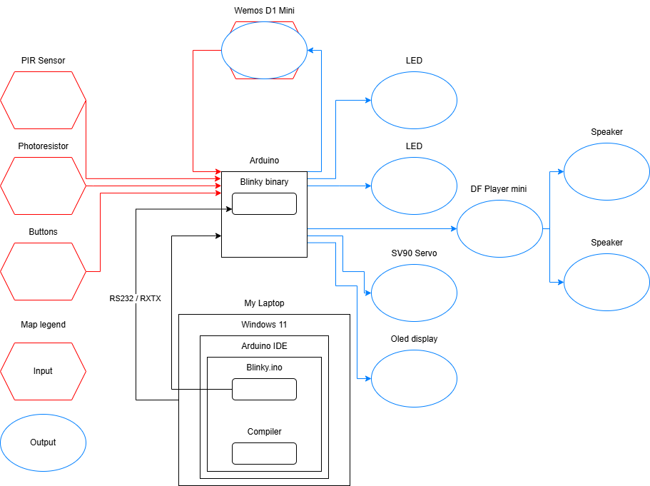

# System Architecture

On this page you can describe the system architecture of your full-project. This includes the architecture of the software, the hardware and the communication between them. Make sure you create a clear overview, don't forget everything that is included in the existing Docker environment.

Keep your system architecture up-to-date during the project. It is a living document that should reflect the current state of your project.

Pir Sensor: Since it's used to detect someone's presence, I'd like to use it to let me play a sound and light up 2 LEDs to simulate red eyes with a voice that says, Machine Spirits are conscious. As for the leds, I'm planning to 3D print the astra militarum emblem and where its eyes are, so that I can light them up. As for the code, I wanted to get the information and be able to use it.

Wemos D1 mini: This is going to be my gateway that will allow me to send all the information that the user enters into my website and send it to the intelligent calendar. I think with APIs it should work, but I haven't figured out how I'm going to do it yet.

SV90 Servo: This will enable me to move my “cuckoo”, which I'm going to replace with a commissair. I preferred to use it because, from what I understood, it was a continuous movement and not a stroke-by-stroke one.

DFRobot DFPlayer Mini: This will enable me to store (using an SD card) and manage the audio files I want to use.

Buttons : When the user presses the button, it switches to silent mode.

Led: As I said before, this will allow me to illuminate them when someone is in front of my smart calendar.

Speaker: This will allow me to play a sound

Photoresistor: Detects whether the device is in the dark; if it is, it switches to silent mode if the user wants to go to sleep.

Oled display : It's purely for the “beauty” of my project, it's just to support my universe. I wanted to have a compositor that would allow me to simulate the impulses of a heart, to pretend that the machine's mind was in my intelligent calendar

Arduino: It is the centerpiece of my project, it is the one that will receive all the programs that I need to create