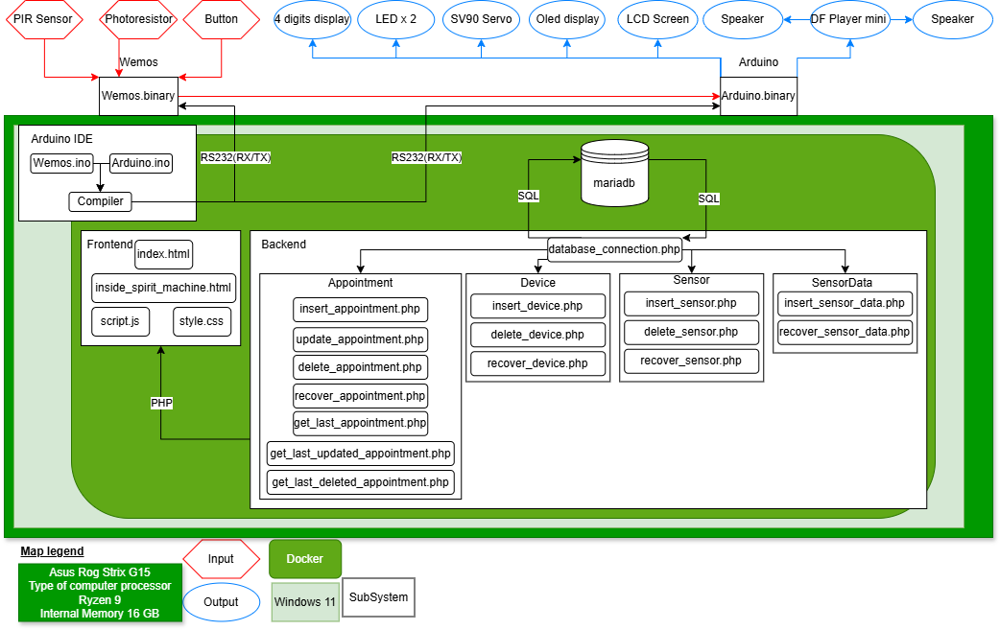

# System Architecture

This page describes the system architecture of the full project, including software, hardware, and their communication. It provides a clear overview of all components within the existing Docker environment.  

This document is regularly updated to reflect the current state of the project.

---

**Introduction**  

This document outlines the system architecture of my project, Field Command: Pattern Cuckoo, presenting a structured overview of its components, including software, databases, and network elements. It explains how these components interact with each other.  
The described architecture includes all elements currently present in the Docker environment.  
Its primary purpose is to serve as a reference for understanding the system.

---

**Legend**  

---

## SAD#01, SAD#02, and SAD#03  

  

---

## SAD#04  

| Source         | Destination        | Protocol | Port | Description                            |
|----------------|--------------------|----------|------|----------------------------------------|
| ESP32          | PHP API            | HTTP     | 80   | Retrieves + sends sensor data          |
| ESP32          | NTP Pool           | UDP      | 123  | Time synchronization                   |
| ESP32          | Internal Web Server| HTTP     | 80   | Testing / character switching          |
| Mobile Device  | `iot-nginx`        | HTTPS    | 443  | User interface                         |
| `iot-nginx`    | `iot-php`          | FastCGI  | 9000 | API Proxy                              |
| `iot-php`      | `iot-mariadb`      | MySQL    | 3306 | SQL Queries                            |
| `phpmyadmin`   | `iot-mariadb`      | MySQL    | 3306 | DB Administration                      |
| Vite DevServer | Web Browser        | WebSocket| 5173 | Live reload / frontend development     |
| `iot-tunnel`   | Internet           | HTTPS    | auto | Public exposure of the project         |
| Host           | GitLab             | SSH      | 22   | Code Push/Pull                         |

---

## SAD#05  

---

## SAD#06  

### Hardware Components  

- **ESP32**  
- **Sensors**: PIR (motion), LDR (light), button  
- **Actuators**: Servo motor, DFPlayer Mini (audio)  
- **I2C LCD Display (16x2)**  
- **7-segment TM1637 display**  

**ESP32 Software (C++)**  

**Libraries Used**  

| Library                   | Role                                                                          |
|---------------------------|--------------------------------------------------------------------------------|
| `WiFi.h`                  | Connects ESP32 to Wi-Fi network                                               |
| `HTTPClient.h`            | HTTP communication with PHP APIs                                              |
| `ArduinoJson.h`           | Processes JSON data sent/received from the API                                |
| `DFRobotDFPlayerMini.h`   | Controls DFPlayer module for audio playback                                   |
| `NTPClient.h` + `WiFiUdp.h`| Time synchronization via NTP protocol                                        |
| `LiquidCrystal_I2C.h`     | Manages LCD display (text, system status)                                     |
| `TM1637Display.h`         | Displays time on 7-segment display                                            |
| `ESP32Servo.h`            | Smooth servo motor control                                                    |
| `WebServer.h`             | Built-in HTTP server (port 80) for local commands (e.g., switching)           |

**Main Functions**  
- Retrieves appointments via API and displays them on the LCD  
- Sends sensor data to the database via HTTP  
- Plays sounds via DFPlayer based on events or time  
- Automatically switches to night mode based on ambient light  

---

## SAD#07  

#### Static Frontend (HTML Pages)  
- `index.html`, `inside_spirit_machine.html`  
- CSS: Tailwind  
- JS: Interactions, decrypt effect  
- Three.js + STLLoader for 3D models  

#### Dynamic Frontend (Svelte SPA)  
- `App.svelte`, `main.js` (Svelte)  
- `vite.config.js` (dev server)  
- `style.css`, `index.html` (entry point)  
- DevServer: Vite (port 5173)  

**Backend**  

**REST APIs located in `/web/Database/`**  

**`/Appointment/`**  
- `getAllAppointments.php`  
- `getAppointmentByID.php`  
- `postAppointment.php`  

**`/Device/`**  
- `getAllDevices.php`  
- `getDeviceByID.php`  
- `postDevice.php`  

**`/Sensor/`**  
- `getAllSensors.php`  
- `getSensorByID.php`  
- `postSensor.php`  

**`/SensorData/`**  
- `getAllSensorData.php`  
- `getSensorDataByID.php`  
- `postSensorData.php`  

---

## SAD#08  
- Container: `iot-mariadb`  
- Databases: `iot`, `mysql`, `performance_schema`  
- Tables: `Appointment`, `Device`, `Sensor`, `SensorData`  

---

## SAD#09  
- `iot-hoegyv-php`, `iot-hoegyv-tunnel` (custom images)  
- `nginx:latest`, `mariadb:latest`, `phpmyadmin/phpmyadmin`  

---

## SAD#10  
Containers running in the `iot_default` network:  
- `iot-nginx`: Web server (port 80)  
- `iot-php`: PHP-FPM backend  
- `iot-mariadb`: MariaDB database (port 3306)  
- `iot-phpmyadmin`: DB admin interface  
- `iot-tunnel`: SSH/HTTP tunnel for public exposure  

---

## SAD#11  
- Personal computer ASUS ROG Strix
- Operating system Windows 11
- Installed tools: Docker Engine, Git, IDE, browser  

---

## SAD#12  
- Android  
- Mobile OS + Chrome/Safari browser  
- Frontend interface access via HTTPS  

---

## SAD#13  
- Wi-Fi box or router  
- Connects all devices to the local network + Internet  

---

## SAD#14  
- Remote GitLab  
- `.gitlab-ci.yml`, `.gitmodules`  
- Uses SSH for push/pull  

---

## SAD#15  
- GitLab via HTTPS/SSH (port 22)  
- Public web access via `iot-nginx`  
- Tunnel via `iot-tunnel`  

---

## SAD#16  
- Container: `iot-tunnel`  
- Image: `iot-hoegyv-tunnel`  
- Public project exposure via HTTP/HTTPS tunnel  

---

**Last updated: April 7, 2025**