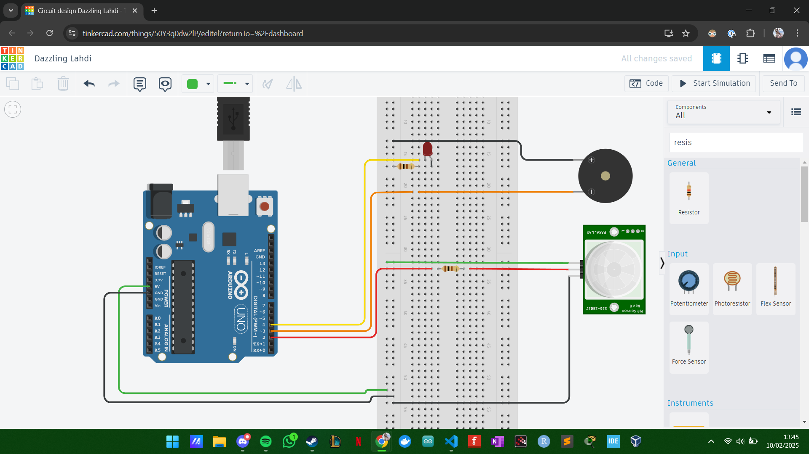

# System Architecture

On this page you can describe the system architecture of your full-project. This includes the architecture of the software, the hardware and the communication between them. Make sure you create a clear overview, don't forget everything that is included in the existing Docker environment.

Keep your system architecture up-to-date during the project. It is a living document that should reflect the current state of your project.

This is my very first circuit model where I tried to figure out how to connect the PIR sensor with a speaker. Two things I'd never done before. 

This is my second circuit model where I put all my components that I bought on the Internet. I did a lot of research to understand how each component works, especially the one that allows me to manage the MP3 DFPlayer Player Module.