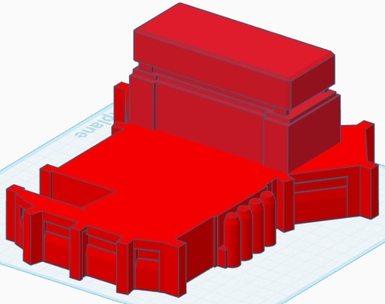
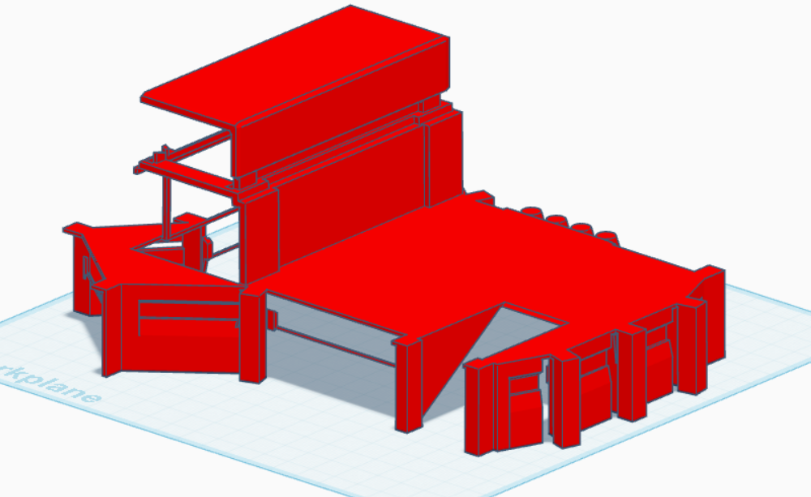
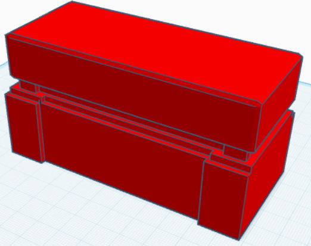
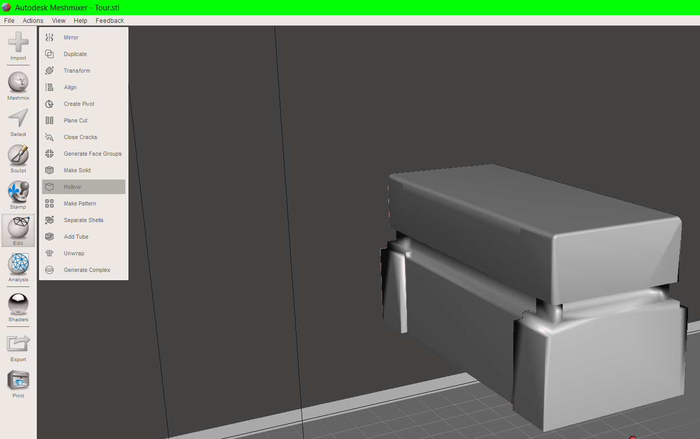
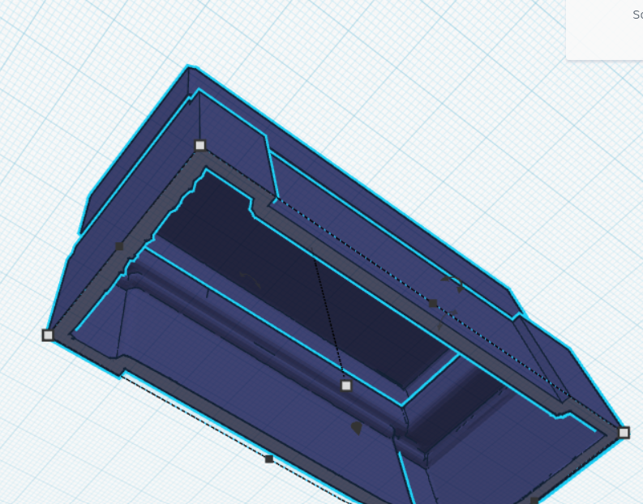
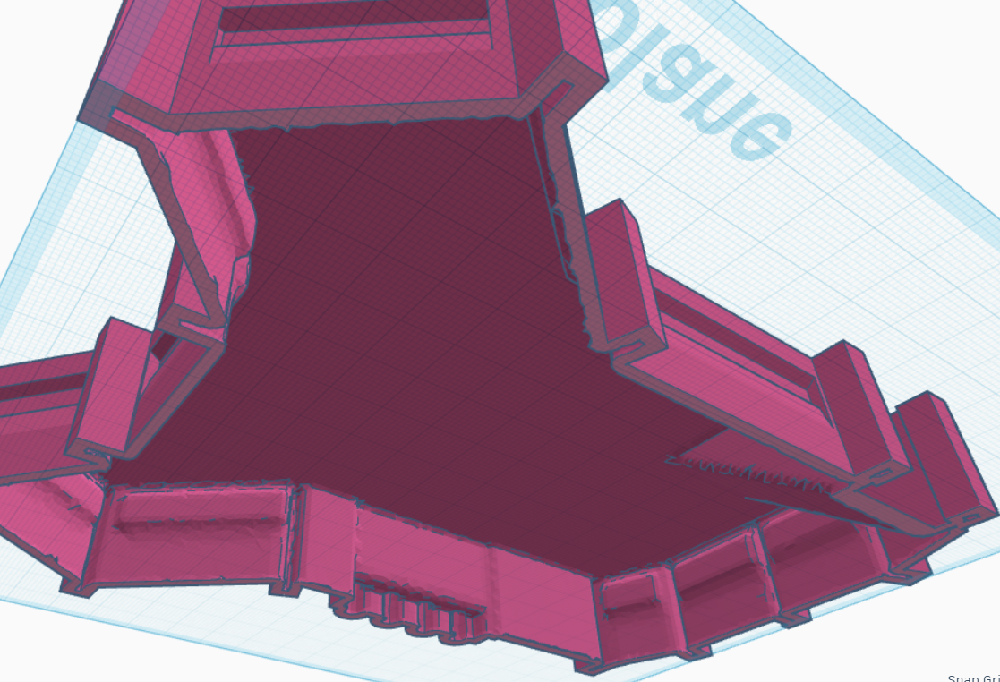
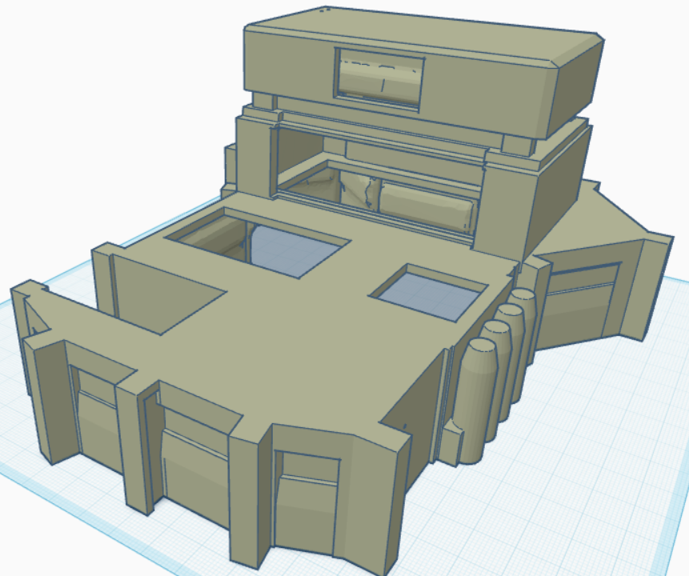

# Concept & Design

Write here your own content!

## Project Goal 

The main goal is to offer Warhammer 40,000 fans an interactive way to manage their calendar. This is done through a personalized smart calendar that blends physical and digital interaction, allowing users to add and manage appointments via a web interface. Each interaction is enhanced by audio and visual feedback from the Warhammer universe. The final goal is to have a fully functional prototype by the end of the ten weeks.

## Utilisateur Cible 

- **Public cible :** Fans de l'univers Warhammer 40,000 (communauté estimée entre 30 et 50 millions de personnes).
- **Contexte d'utilisation :** Les utilisateurs souhaitent ajouter des tâches à leur calendrier, mais le processus est répétitif et chiant.
- **Problématique :** Ajouter des tâches au calendrier est monotone.
- **Solution :** Un calendrier intelligent thématisé Warhammer, réactif à la présence de l'utilisateur, avec effets lumineux et sons emblématiques.

## User Stories

US01 : En tant que fan de Warhammer, je veux entendre des voix emblématiques lorsque j'ajoute un rendez-vous afin de vivre une expérience immersive.

US02 : En tant qu'utilisateur, je veux ajouter des rendez-vous rapidement via une interface web pour gagner du temps.

US03 : En tant qu'utilisateur curieux, je veux découvrir une interface de calendrier originale afin que mon expérience soit nouvelle et engageante.

US04 : En tant que passionné, je veux pouvoir choisir une voix pour chaque rendez-vous afin de le personnaliser.

US05 : En tant qu'utilisateur, je veux que le calendrier réagisse à ma présence afin que l'objet paraisse vivant.

## Exigences 

PR01 : Le calendrier doit détecter la présence de l'utilisateur et allumer les yeux de l'emblème Warhammer.

PR02 : L'interface doit permettre l'ajout ou la modification de rendez-vous en moins de 20 secondes.

PR03 : Chaque interaction doit déclencher un son issu des jeux Warhammer.

PR04 : L'utilisateur doit pouvoir sélectionner une voix personnalisée pour chaque rendez-vous.

PR05 : L'appareil doit intégrer un écran LCD et un capteur PIR.

## Fabrication Numérique & Matériaux

- **Logiciel utilisé :** Tinkercad  

Choisi pour sa simplicité

- **Matériau utilisé :** **PLA** 

  Le PLA a été choisi pour sa facilité d'impression, sa faible déformation et sa finition esthétique, idéale pour un objet décoratif comme ce calendrier intelligent.

- **Pourquoi cette méthode ?**  

Tinkercad et le PLA permettent un prototypage rapide, un design précis des pièces, et une compatibilité avec les imprimantes 3D

**Inspiration & Références Visuelles**

Vue de face

---

Vue arrière

---

Côté droit

---

Côté gauche

---

Vue du dessus

---

### 2. **Prototypage 3D via Tinkercad**
> Construction étape par étape : base, tours, générateurs, portes, postes d'observation.

**Step 1 :** Création d'un premier rectangle pour servir de base ( 86 mm x 74 mm)

---

[Télécharger Step 2](https://gitlab.fdmci.hva.nl/IoT/2024-2025-semester-2/individual-project/buudiizaaduu29/-/blob/main/docs/uxd/3D%20Model/Step2.stl?ref_type=heads)

**Step 2 :** Ajustement du rectangle pour entourer la base

---

**Step 3 :** Découpe du rectangle pour créer un pilier

---

[Télécharger Step 4](https://gitlab.fdmci.hva.nl/IoT/2024-2025-semester-2/individual-project/buudiizaaduu29/-/blob/main/docs/uxd/3D%20Model/Step4.stl?ref_type=heads)

**Step 4 :** Répétition du processus pour plusieurs piliers

---

**Step 5 :** Tentative de création de générateurs d'énergie

---

[Télécharger Step 6](https://gitlab.fdmci.hva.nl/IoT/2024-2025-semester-2/individual-project/buudiizaaduu29/-/blob/main/docs/uxd/3D%20Model/Step6.stl?ref_type=heads)

**Step 6 :** Dupliquer les générateurs

---

**Step 7 :** Agrandissement de la base

---

[Télécharger Step 8](https://gitlab.fdmci.hva.nl/IoT/2024-2025-semester-2/individual-project/buudiizaaduu29/-/blob/main/docs/uxd/3D%20Model/Step8.stl?ref_type=heads)

**Step 8 :** Installation du poste d'observation

---

[Télécharger Step 9](https://gitlab.fdmci.hva.nl/IoT/2024-2025-semester-2/individual-project/buudiizaaduu29/-/blob/main/docs/uxd/3D%20Model/Step9.stl?ref_type=heads)

**Step 9 :** Duplication du poste d'observation

---

### 4. **Amélioration & Correction**
> Retouches esthétiques, ajustement des proportions et perçages pour composants.

[Télécharger Step 10](https://gitlab.fdmci.hva.nl/IoT/2024-2025-semester-2/individual-project/buudiizaaduu29/-/blob/main/docs/uxd/3D%20Model/Step10.stl?ref_type=heads)

**Step 10 :** Refaire les générateurs d'énergie jugés peu esthétiques

---

**Step 11 :** Agrandissement des générateurs

---

**Step 12 :** Découpe de l'extrémité et duplication

---

**Step 13 :** Ajout d'une porte

---

**Step 14 :** Création d'un rectangle pour la tour

---

**Step 15 :** Découpe du rectangle pour une forme plus travaillée

---

**Step 16 :** Agrandissement de la tour

---

**Step 17 :** Ajout d’un carré sur la tour et réduction de la partie centrale pour un aspect poste d’observation

---

[Télécharger Step 18](https://gitlab.fdmci.hva.nl/IoT/2024-2025-semester-2/individual-project/buudiizaaduu29/-/blob/main/docs/uxd/3D%20Model/Step18.stl?ref_type=heads)

**Step 18 :** Ajout de la tour sur la base

---

[Télécharger Step 19](https://gitlab.fdmci.hva.nl/IoT/2024-2025-semester-2/individual-project/buudiizaaduu29/-/blob/main/docs/uxd/3D%20Model/Step19.stl?ref_type=heads)

**Step 19 :** Agrandissement pour accueillir l’écran LCD et le capteur PIR

---

**Step 20 :** Tentative de rendre la base creuse

---

**Step 21 :** Décision de diviser le modèle en deux parties : base et tour

---

### **Export final pour fabrication**

> Modèle final divisé en base + tour, exporté en STL, prêt à être imprimé.

[Télécharger la tour](https://gitlab.fdmci.hva.nl/IoT/2024-2025-semester-2/individual-project/buudiizaaduu29/-/blob/main/docs/uxd/3D%20Model/Step222.stl?ref_type=heads)

[Télécharger la base](https://gitlab.fdmci.hva.nl/IoT/2024-2025-semester-2/individual-project/buudiizaaduu29/-/blob/main/docs/uxd/3D%20Model/Step2222.stl?ref_type=heads)

**Step 22 :** Finalisation des formes et creuser les volumes via Meshmixer

---

### **Intégration des composants**

> Prévision de l'espace pour capteur PIR, écran LCD et fils.

[Télécharger la version finale](https://gitlab.fdmci.hva.nl/IoT/2024-2025-semester-2/individual-project/buudiizaaduu29/-/blob/main/docs/uxd/3D%20Model/Last.stl?ref_type=heads)

**Step 23 :** Perçage pour les composants et préparation à l'impression 3D

---

