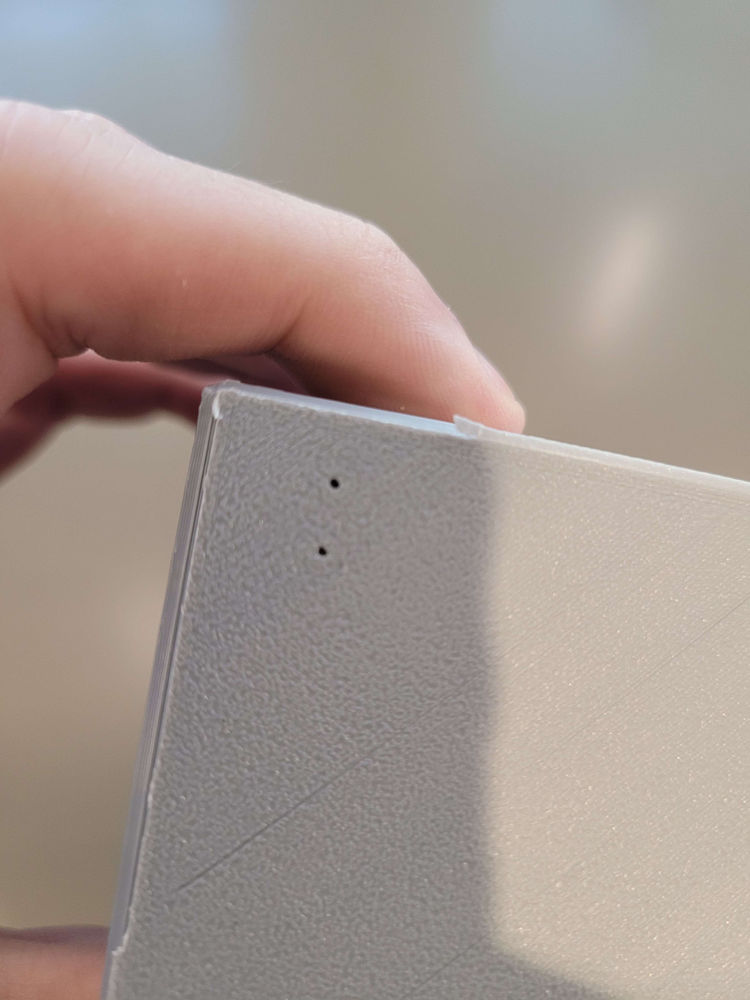
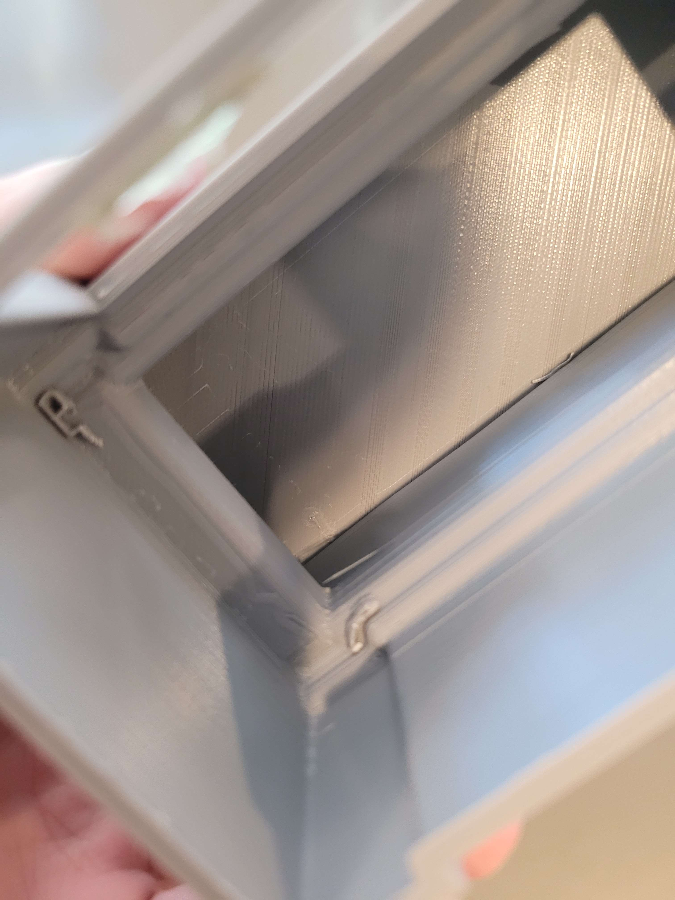
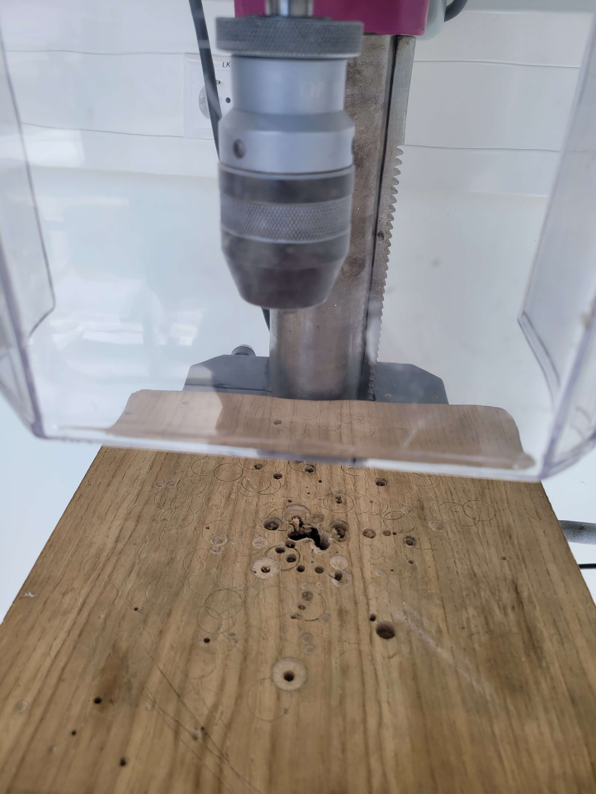
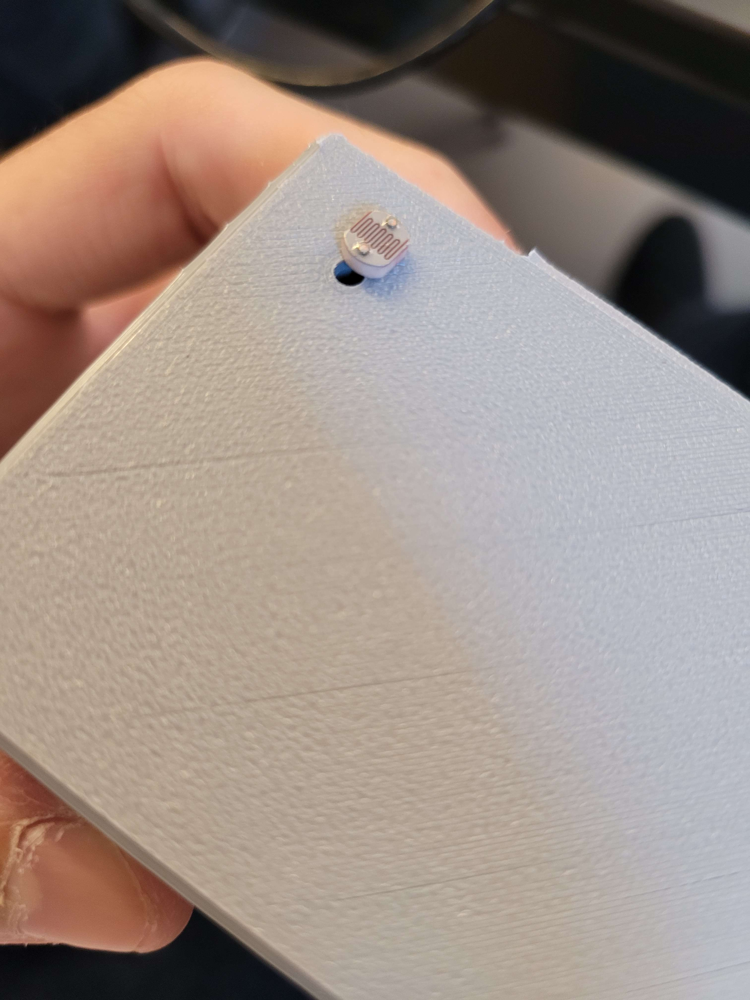
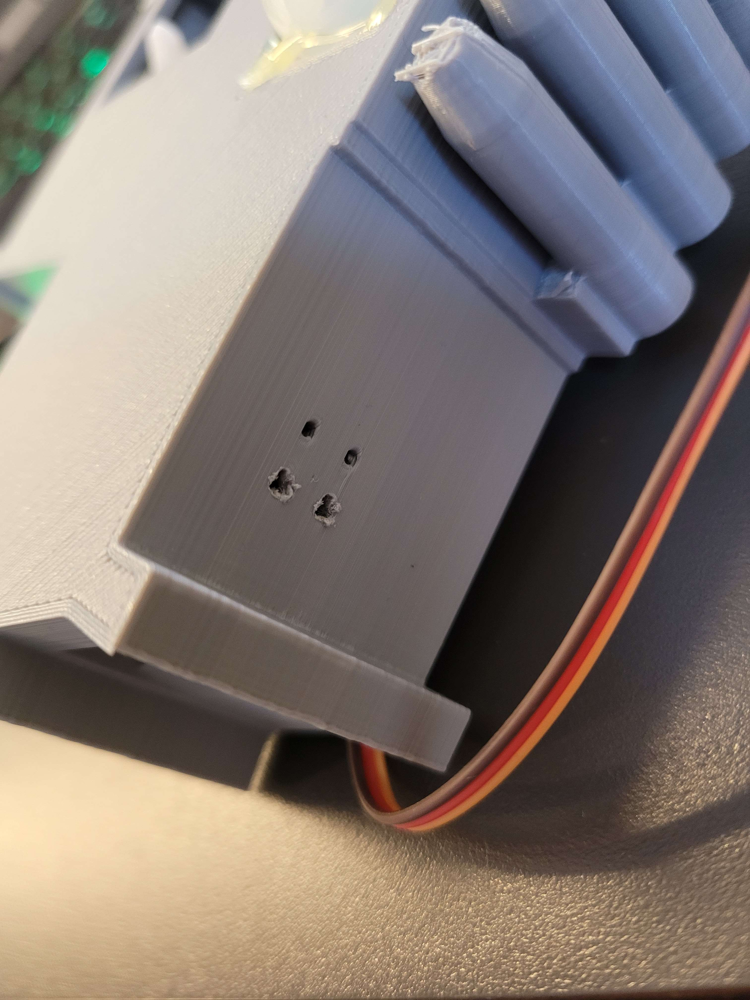
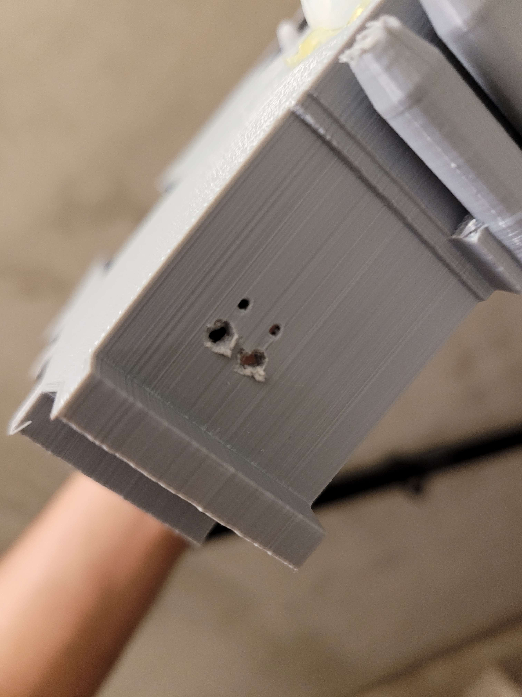
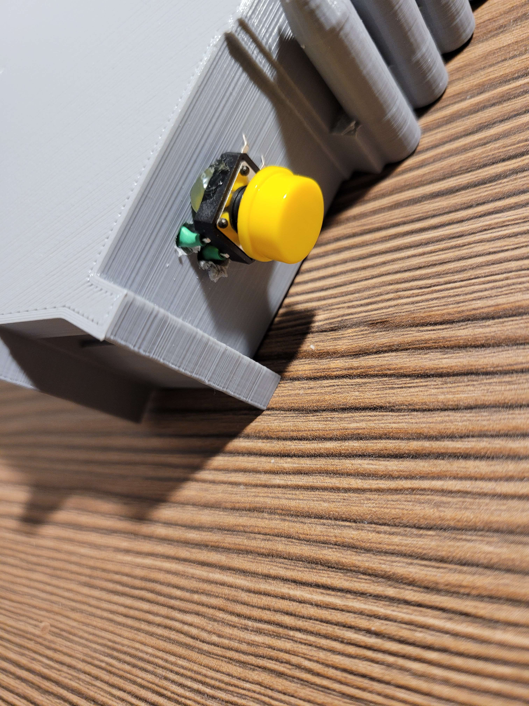
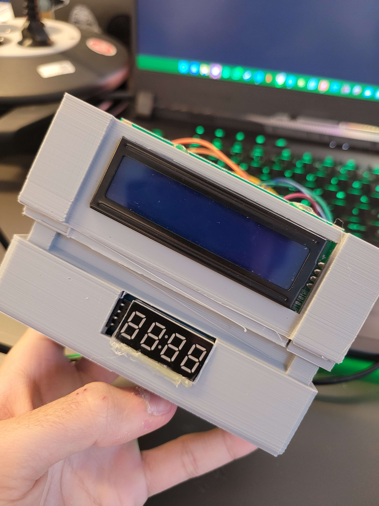
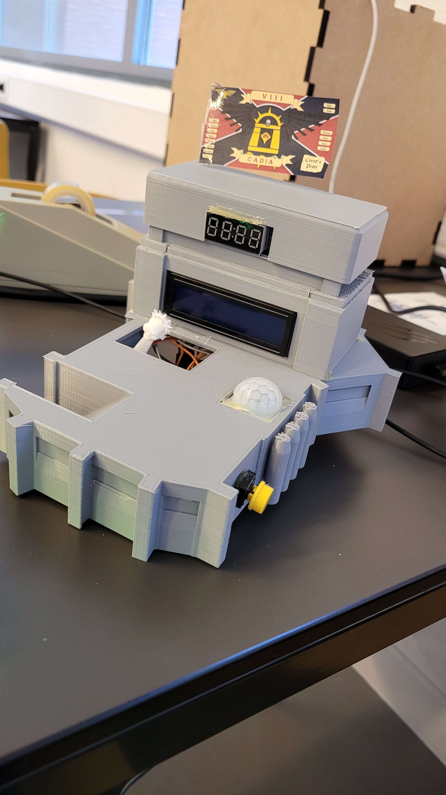

Voici la **traduction fidèle en anglais**, sans modifier la structure ni l’indentation de ton texte :

---

# Conclude & Reflect

Write here your own content!

## Reflection

The prototype of my connected calendar successfully meets most of the initial user and technical requirements:

- The interface allows appointments to be added, edited, and deleted.  
- The server functions perfectly and ensures smooth communication with the hardware.  
- Voice feedback works correctly both from the interface and through the physical sensors.  
- The cuckoo mechanism activates automatically every hour, as intended.

However, some features remain partially implemented or require further adjustment:

- The cuckoo is triggered with a one-minute delay, for an unknown reason.  
- I did not implement an audio notification when an appointment is reached, although it was part of the original concept.

---

## Issues Encountered

Throughout the process, I faced several challenges that helped me better understand the practical constraints of modeling and digital fabrication. Here are the main problems encountered:

---

## Incorrect sensor hole sizing (Tower)

- **Goal:** Print a tower with openings suited for the sensors  
- **Issue:** I miscalculated the dimensions and had to fully rebuild the tower.  
- **Temporary fix:** I corrected the STL file with accurate measurements.  
- **Next time:** I will first create a test plate to check dimensions before final printing.

---

## Poorly printed holes for the photoresistor

- **Goal:** Print functional holes to integrate the photoresistor.  
- **Issue:** The holes were not properly formed during printing.  
- **Solution:** I used a manual drill in another building to correct them.  
- **Future improvement:** Better orientation during printing and/or slightly larger holes.

---

## Button holes placed too close together

- **Goal:** Provide enough space for the wires and physical button.  
- **Issue:** The holes were too close to the edge, and the part had already been glued.  
- **Solution:** I cut the holes manually with a knife because it was too late to drill.  
- **Lesson learned:** Always validate critical spacing before final assembly. I now plan for extra margin around components.

---

## Incorrect LCD measurement

- **Goal:** Create a perfectly sized opening for the screen.  
- **Issue:** I measured it upside down, and the screen didn’t fit properly.  
- **Solution:** I had to force it into place.  
- **Next time:** I won’t take my measurements at 3 a.m.

---

## Not enough space for the photoresistor after wiring

- **Goal:** Neatly integrate all wires and components into the tower.  
- **Issue:** Once everything was installed, the photoresistor no longer fit and was sticking out.  
- **Solution:** I hid the part with a decorative flag.  
- **Planned improvement:** Plan cable routing more carefully and allow more free space during design.

---

To improve this project in a future version, I plan to:

- Add a voice notification when an appointment is reached  
- Fix the timing delay of the cuckoo  
- Redesign the internal layout of the tower to simplify wiring