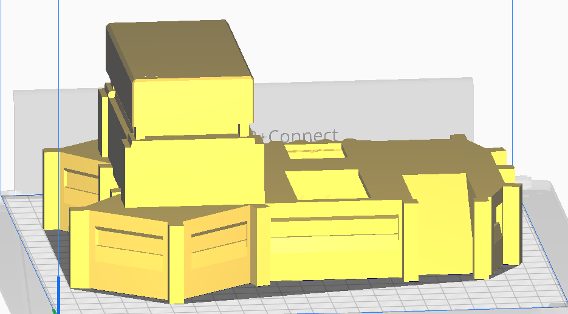
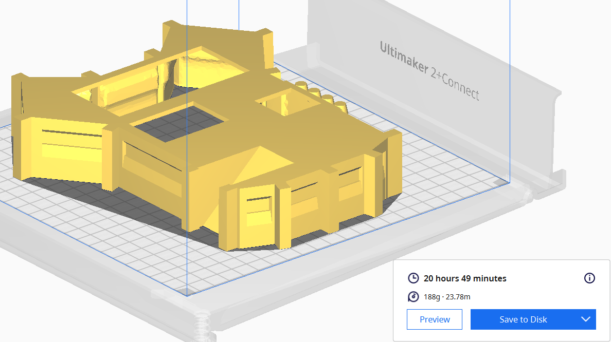
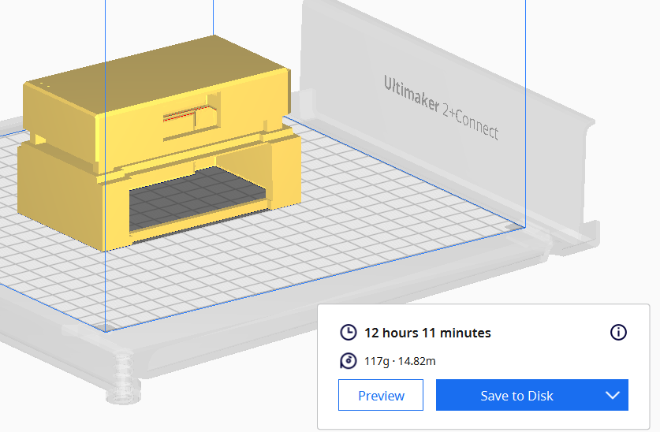
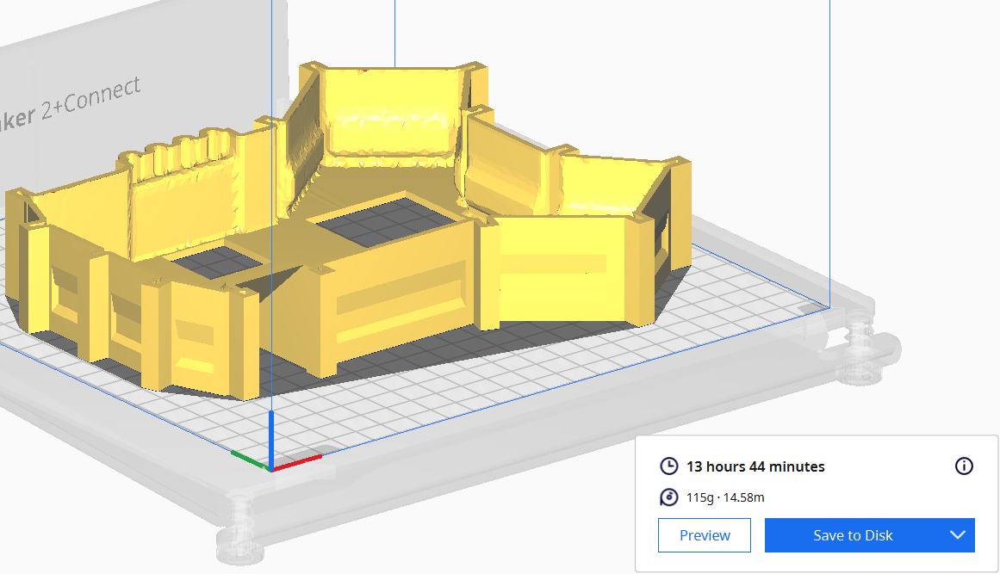
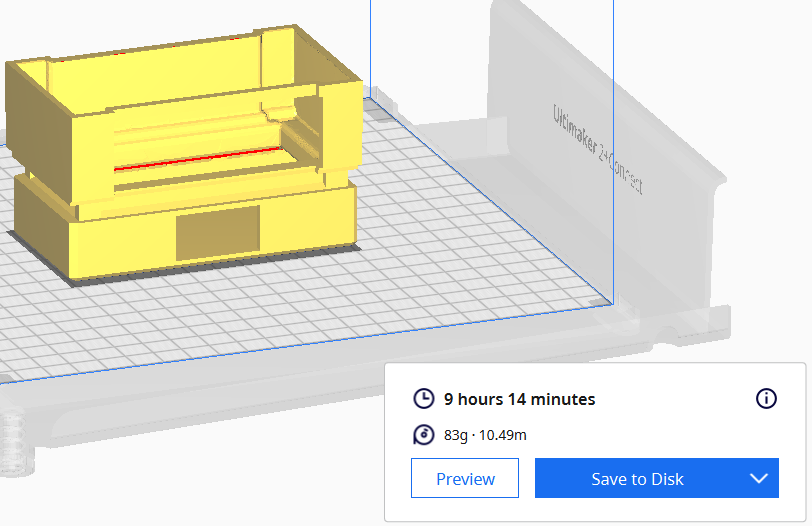

# Create & Test

Write here your own content!

## Optimisations

**Quality**

Layer Height **0.15 mm**

---

**Walls**

Wall Thickness **0.8 mm**

Wall Line Count **2**

Horizontal Expansion **-0.015 mm**

---

**Top / Bottom**

Top / Bottom Thickness **0.75 mm**

Top Layers **5**

Bottom Layers **5**

---

**Infill**

Infill Density **20 %**

Infill Pattern **Grid**

---

Material 

Printing Temperature **210.0 °C**

Build Plate Temperature **60 °C**

---

**Speed**

Print Speed **60.0 mm/s**

---

**Support**

Support Structure **Normal**

Support Placement **Everywhere**

Support Overhang Angle **50.0 °**

Support horizontal Expansion **0.8 mm**

---

When I split them, I reduce the time by **1h41**

---

But when I flip them I reduce the time by **11 hours et 34 minutes !**

