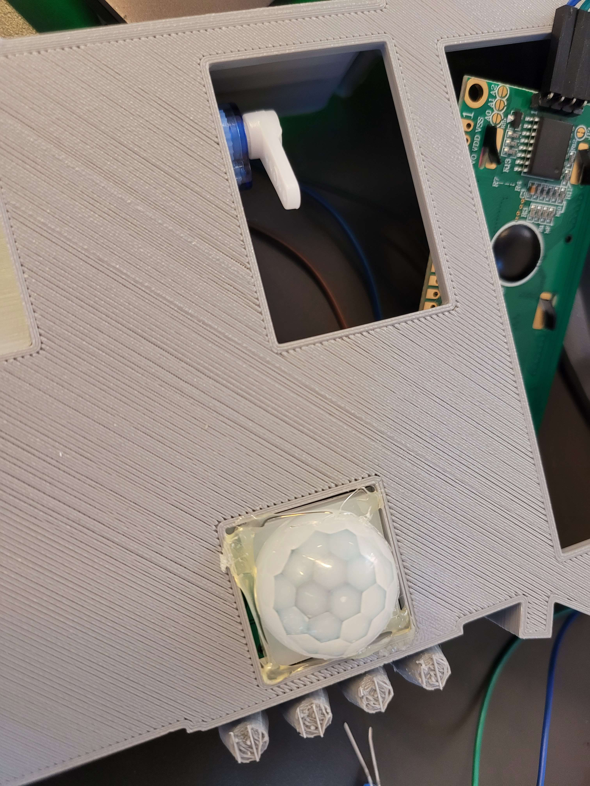
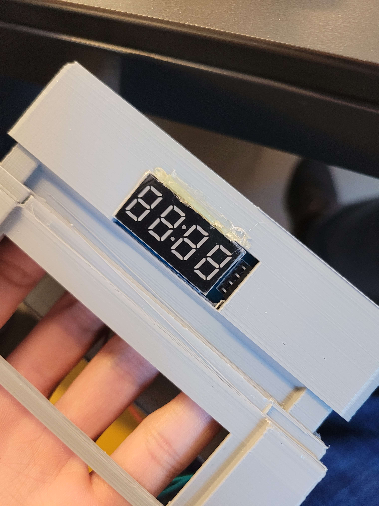
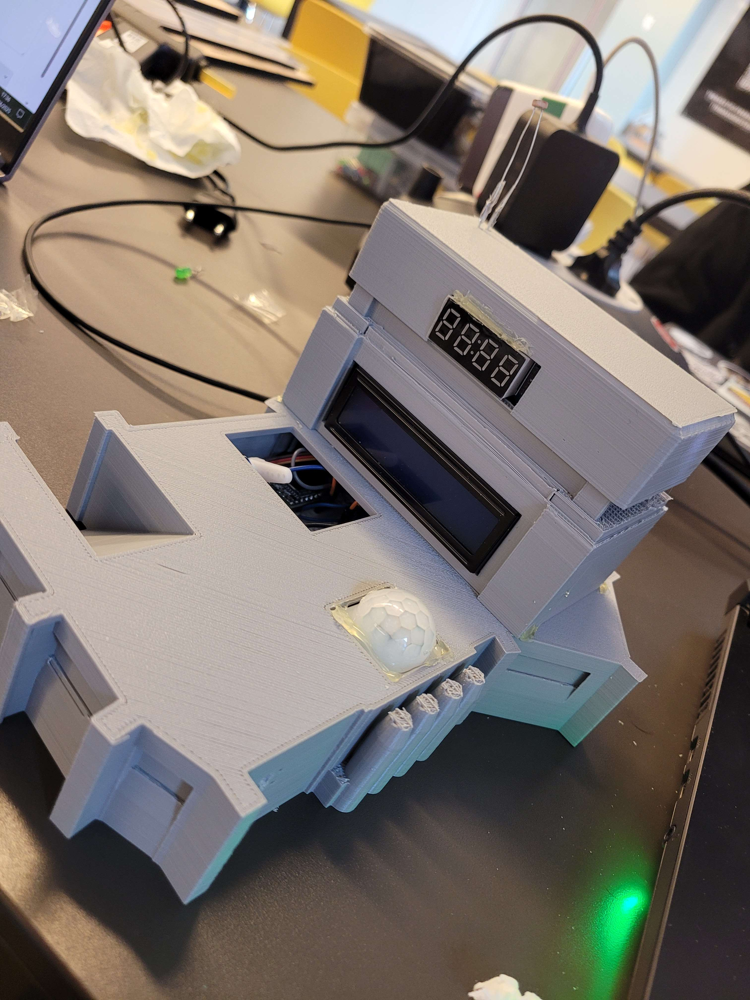
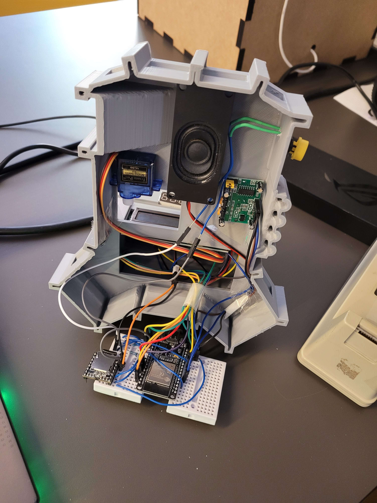

# Create & Test

Write here your own content!

## **DIGITAL MANUFACTURING**

The print was carried out using an Ultimaker 2+ Connect, equipped with a 0.4 mm nozzle. The filament used is grey PLA, 1.75 mm in diameter, chosen for its ease of use, stable behavior without a heated enclosure, and perfect compatibility with fast printing settings. PLA has the advantage of limiting warping and allows for higher print speeds than ABS or PETG, while remaining biodegradable under industrial composting conditions.

### PLA Specifications:

Density: ~1.24 g/cm³

Glass transition temperature: ~60°C

Melting temperature: 180–220°C

Tensile strength: ~37 MPa

Elongation at break: ~6%

Printing settings used (Ultimaker Cura)

Layer height: 0.1 mm

Wall thickness: 3 wall lines

Infill: 20% (Gyroid pattern)

Print speed: 50 mm/s

Nozzle temperature: 200°C

Bed temperature: 60°C

Cooling: fan at 100%

Supports: enabled, placed everywhere, overhang angle at 50°, horizontal expansion 0.8 mm

Optimise your design according to your manual manufacturing experience

**Quality**

Layer Height **0.15 mm**

---

**Walls**

Wall Thickness **0.8 mm**

Wall Line Count **2**

Horizontal Expansion **-0.015 mm**

---

**Top / Bottom**

Top / Bottom Thickness **0.75 mm**

Top Layers **5**

Bottom Layers **5**

---

**Infill**

Infill Density **20 %**

Infill Pattern **Grid**

---

**Material** 

Printing Temperature **210.0 °C**

Build Plate Temperature **60 °C**

---

**Speed**

Print Speed **60.0 mm/s**

---

**Support**

Support Structure **Normal**

Support Placement **Everywhere**

Support Overhang Angle **50.0 °**

Support horizontal Expansion **0.8 mm**


---


When I split them, I reduce the time by **1h41**

---


[Files on GitLab](https://gitlab.fdmci.hva.nl/IoT/2024-2025-semester-2/individual-project/buudiizaaduu29/-/tree/main/docs/uxd/Create?ref_type=heads)

But when I flip them I reduce the time by **11 hours and 34 minutes !**

---

## Manufacturing

The first step is to fit the servo motor and the pir sensor



Then we take care of the button


We'll take care of the 7 segments



We'll take care of the LCD screen and the photo resistance



We take care about the jumper wires we stick together 



And we hang the flag


## **User Test Plan**

### **Objective**
Evaluate the usability, clarity, and functionality of the Warhammer-themed smart calendar’s web interface, focusing on ease of adding/modifying appointments and immersive user feedback (audio/visual).

## **Test Scenarios**

### **Appointment Creation Flow**

**Objective:** Ensure the user can create and modify an appointment intuitively and quickly.  

**Steps:**

- Access the website homepage.
- Click on the "Log Your Sacred Duty" button.
- Add an appointment with title and time.
- Try modifying it right after.

**Expected Outcome:**  

The task should be completed in under 20 seconds without assistance, and the user should feel guided throughout.

**Result:**

Most users completed the action smoothly, but a few were confused by the color and position of the “Delete” and “Modify” buttons.

---

### **Immersion**

**Objective:** Assess whether Warhammer 40K fans feel immersed by the sounds and visuals. 

**Steps:**

- Trigger the voice line and animation by adding a task.
- Hover over or interact with thematic icons and elements.

**Expected Outcome:**  

Fans should recognize and appreciate the Warhammer-themed feedback. Non-fans should still find the experience visually and auditorily engaging.

**Result:**  

Fans loved the aesthetic and voice effects. Non-fans found it “unique” but some suggested more guidance to understand the context.

---

### **Interface Clarity**

**Objective:** Measure how clearly the interface communicates each function.  

**Steps:**

- Try deleting or editing an existing appointment.
- See if the buttons and color scheme are intuitive.
- Try using the system without prior explanation.

**Expected Outcome:** 

Users should not accidentally delete an appointment or get confused during the edit process.

**Result:**  

Several users found the “Delete” button too close to the “Edit” one, creating hesitation. Colors weren’t always intuitive (e.g., Cancel and Confirm looked similar).

---

## **Feedback Collection**

**Method:** short interviews 

**Participants:** 6 users (3 Warhammer fans, 3 non-fans)  

**Key Questions:**

- Was the interface intuitive ?
- Did you enjoy the Warhammer visuals ?
- Did you face any confusion when editing appointments?
- Would you use such a calendar in daily life ?
- Suggestions for improvement ?

---

## **Success Metrics**

- **≥4/5 average rating** on usability and thematic satisfaction  
- **≤1 user out of 6** experiencing blocking confusion  
- **Average task time** < 20 seconds to add or edit a task  

---

## **Test Results**

| **Question**                                       | **Average Score (out of 5)** |
|----------------------------------------------------|------------------------------|
| Was the interface intuitive to use ?                | 4.2                          |
| Were the visuals/sounds enjoyable ?    | 4.8                          |
| Did you understand what each button did ?           | 3.5                          |
| Would you use such a product regularly ?            | 3.3                          |

**Suggestions for Improvement:**

- Change the color of Cancel/Modify/Delete buttons
- Remove the “Delete” option during editing

---

## **Optimisations Based on Feedback**

**Changed button colors** to make Cancel/Modify/Delete clearer  
**Disabled "Delete" during edit mode** to reduce errors  

Example:
```js
// Tooltip on edit button
editButton.setAttribute("title", "Modify your sacred duty");
```

