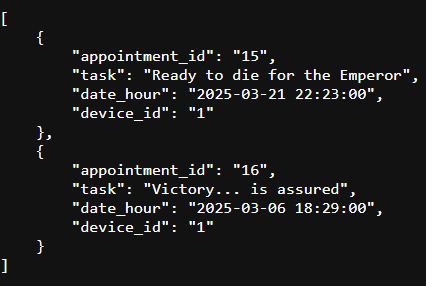
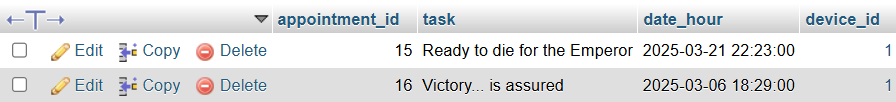
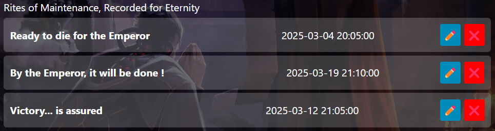

# API reference

Write here your own content!

## Appointment

Concerning the appointment part, I use several APIs, in particular 4, an API that lets me send an appointment from my website to the database, an API that lets me delete it from my website and modify it.
The last API I use allows me to retrieve the appointments I have on my database. I did a test with my friend and when I sent him the link to my website, he was able to see the appointments I had put there.

## Recover all appointments

This endpoint recover the complete list of appointments stored in the database

URL (Endpoint)

- http://localhost/Database/Appointment/recover_appointment.php

Request Method

- GET ( Because all I need to do is read the data stored in my database, and make no changes. I just recover everything )

Arguments

- None 

Return Value

- A JSON table containing all appointments

Proof of Execution

---

## Insert appointment

This endpoint allows you to add an appointment to the database

URL (Endpoint)

- http://localhost/Database/Appointment/insert_appointment.php

Request Method

- POST ( Because I need it to send new data to my database )

Arguments

- task (string, required) -> Name of task

- date_hour (string - format YYYY-MM-DD HH:MM:SS, required) → Date and time of appointment

- device_id (integer, required) → ID of the device associated with the appointment

Warning : if an argument is missing, it will not work

Return Value

Proof of Execution

