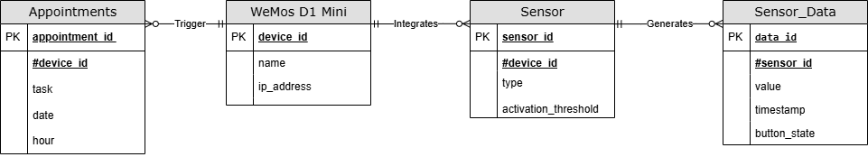
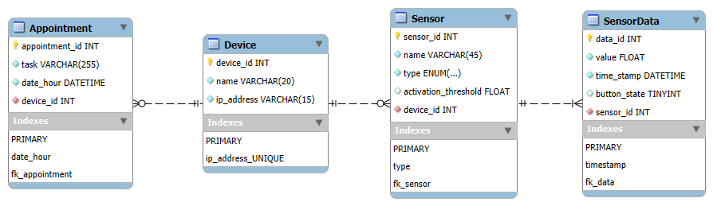

# Database

Write here your own content!

---

Let's start with the table, which is the most important for me, because it's the table at the heart of my project. Knowing that I'm doing the smart calendar, if I can't retrieve the appointments entered by the user, that's a bit silly...

### Table Appointments

This table will enable me to manage the various tasks that the user will enter on my website.

As you'd expect, I'll be using two keys: the first will be a primary key appointment_id, which will give me a unique identifier for each appointment. If the user has to see his doctor every month, even if the appointments have exactly the same name, this won't prevent me from identifying them. And for my second key, which will be my foreign key, I'll use device_id, which will link me to my Wemos D1 Mini table, allowing me to associate the corresponding task with a device. 

As for the attributes, I decided to use task for the task (obviously), date for the date (obviously again) and hour (you get the idea).

I decided to choose the relationship ( 1 : N ) because each device ( here, it doesn't really apply because I only have one wemos but if one day there's a need to add a second one, there'd be no problem ) can have several tasks.

---

If a table contains information to be sent, there's bound to be a table that receives it. Let's take a look at this table.

### WeMos D1 Mini

This table allows me to represent the WeMos D1 Mini, a device capable of integrating sensors and performing various tasks.

For the primary key, I decided to use device_id, because I thought that if for some reason I had to plug in a second one, it wouldn't be a problem, because I will be able to identifie it. There's no need to have a foreign key for the Wemos D1 Mini because it doesn't need to be linked to another entity to exist because it integrates sensors and it's linked to tasks, so there's no need to have a foreign key for this table.

Concerning the attributes, name simply stands for the device's name and ip_address for the device's IP address on the network.

I decided to choose the relationship ( 1 : N) because the Wemos D1 Mini can have several sensors, but a sensor is linked to only one Wemos. 

---

I must confess that I don't really have any words to introduce the new table we're about to see, other than to say that it's far from useless. 

### Table Sensor

This table allows me to identify the various sensors connected to the wemos D1 Mini. 

Concerning the keys, the primary key I'm going to use is sensor_id, which will enable me to have a unique identifier for each sensor, even if I add the same sensor I'll be able to identify them. For the foreign key, I've chosen device_id (as you'd expect), which allows me to refer to the device to which the sensor is attached.

For attributes, type for the sensor type, activation_threshold for a sensor activation threshold, e.g. when a person approaches within 1 meter of the smart calendar, an action will be taken.

I decided to choose the relationship ( 1 : N ) because a sensor can generate several pieces of data, but each piece of data is linked to only one sensor.

---

The last table but not least 

### Sensor_Data

This table allows me to store sensor data

Concerning the keys, data_id is my primary key which allows me to set a unique identifier for each piece of data if my sensor sends me the same data several times, this will allow me to identify them no matter how many times the sensor sends the same data. As you'd expect, my foreign key is sensor_id, which allows me to identify the sensor that sent the data

Concerning the attributes, value for the value ( Of course ), timestamp it allows me to record the moment when the data was generated. I can't really do otherwise (well, it's the only idea I had for sorting the data). I figured that sorting by date and time wouldn't be such a bad idea. And button_state for the state of the button, whether it's pressed or not.

As I've already explained the choices for my columns, I'll explain how I went about creating my database schema. I'm not going to dwell too much on the choice of columns, just that I've taken what I'd done before and added them. I'm mainly going to justify the choices I made for my indexes. For the date, I decided to choose only the date and time, as I thought they were the two most important things for finding an appointment.

For the sensors, the type seemed the most relevant because if I can find out what type of sensor it is, I'll be able to find out directly what data I'm receiving. 

And finally, for the sensor data, naturally the timestamp. As soon as I receive the information I can take this or that action