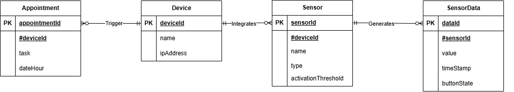
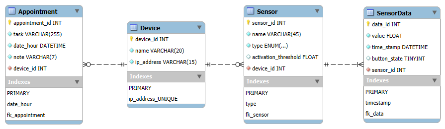

# Database

Write here your own content!

## ERD Diagram



## Database Schema



## Table Structures

### Device Table

```sql
CREATE TABLE IF NOT EXISTS `iot`.`Device` (
  `device_id` INT NOT NULL AUTO_INCREMENT,
  `name` VARCHAR(20) NOT NULL,
  `ip_address` VARCHAR(15) NOT NULL,
  PRIMARY KEY (`device_id`),
  UNIQUE INDEX `ip_address_UNIQUE` (`ip_address` ASC) VISIBLE)
ENGINE = InnoDB;
```

**Explanation:**

Primary Key: device_id (INT AUTO_INCREMENT), unique identifier for each device

**Attributes:**

- name: Name of the device
- ip_address: Unique IP address on the network

**Index:**

On ip_address to ensure uniqueness and speed up searches

### Appointment Table

```sql
CREATE TABLE IF NOT EXISTS `iot`.`Appointment` (
  `appointment_id` INT NOT NULL AUTO_INCREMENT,
  `task` VARCHAR(255) NOT NULL,
  `date_hour` DATETIME NOT NULL,
  `note` VARCHAR(7) NOT NULL,
  `device_id` INT NOT NULL,
  PRIMARY KEY (`appointment_id`),
  INDEX `date_hour` (`date_hour` ASC) VISIBLE,
  INDEX `fk_appointment` (`device_id` ASC) VISIBLE,
  CONSTRAINT `fk_appointment`
    FOREIGN KEY (`device_id`)
    REFERENCES `iot`.`Device` (`device_id`)
    ON DELETE CASCADE
    ON UPDATE CASCADE)
ENGINE = InnoDB;
```

**Explanation:**

Primary Key: appointment_id (INT AUTO_INCREMENT)
Foreign Key: device_id referencing Device table

**Attributes:**

- task: Task description
- date_hour: Combined date and time (DATETIME)
- note: Additional note (limited to 7 characters)

**Index:**

On date_hour to optimize date searches

**Relationship:**

1 device can have N appointments (1:N)

### Sensor Table

```sql
CREATE TABLE IF NOT EXISTS `iot`.`Sensor` (
  `sensor_id` INT NOT NULL AUTO_INCREMENT,
  `name` VARCHAR(45) NOT NULL,
  `type` ENUM('Presence', 'Light', 'Button') NOT NULL,
  `activation_threshold` FLOAT NULL,
  `device_id` INT NOT NULL,
  PRIMARY KEY (`sensor_id`),
  INDEX `type` (`type` ASC) VISIBLE,
  INDEX `fk_sensor` (`device_id` ASC) VISIBLE,
  CONSTRAINT `fk_sensor`
    FOREIGN KEY (`device_id`)
    REFERENCES `iot`.`Device` (`device_id`)
    ON DELETE CASCADE
    ON UPDATE CASCADE)
ENGINE = InnoDB;
```

**Explanation:**

Primary Key: sensor_id (INT AUTO_INCREMENT)
Foreign Key: device_id referencing Device table

**Attributes:**

- name: Sensor name
- type: Predefined type
- activation_threshold: Activation threshold

**Index:**

On type to facilitate sensor type searches

**Relationship:**

1 device can have N sensors (1:N)

### SensorData Table

```sql
CREATE TABLE IF NOT EXISTS `iot`.`SensorData` (
  `data_id` INT NOT NULL AUTO_INCREMENT,
  `value` FLOAT NOT NULL,
  `time_stamp` DATETIME NOT NULL,
  `button_state` TINYINT NULL DEFAULT 0,
  `sensor_id` INT NOT NULL,
  PRIMARY KEY (`data_id`),
  INDEX `timestamp` (`time_stamp` ASC) VISIBLE,
  INDEX `fk_data` (`sensor_id` ASC) VISIBLE,
  CONSTRAINT `fk_data`
    FOREIGN KEY (`sensor_id`)
    REFERENCES `iot`.`Sensor` (`sensor_id`)
    ON DELETE CASCADE
    ON UPDATE CASCADE)
ENGINE = InnoDB;
```

**Explanation:**

Primary Key: data_id (INT AUTO_INCREMENT)
Foreign Key: sensor_id referencing Sensor table

**Attributes:**

- value: Numeric sensor value
- time_stamp: Measurement timestamp
- button_state: Button state (0/1)

**Index:**

On time_stamp to optimize time-based queries

**Relationship:**

1 sensor can generate N data entries (1:N)

## Normalization and Conventions

The database complies with the third normal form:
- No data redundancy
- All dependencies are towards primary keys
- No transitive dependencies

**Conventions used:**

- Table names in PascalCase
- Column names in lowercase_with_underscores
- Primary keys named as table_id
- Foreign keys referenced with fk_ prefix

### Example Insertions

**Device insertion:**

```sql
INSERT INTO Device (name, ip_address)
VALUES ('Calendrier Salon', '192.168.1.10');
```

**Appointment insertion:**

```sql
INSERT INTO Appointment (task, date_hour, note, device_id)
VALUES ('Ready to die for him', '2023-12-15 14:30:00', 'urgent', 1);
```

**Sensor insertion:**

```sql
INSERT INTO Sensor (name, type, activation_threshold, device_id)
VALUES ('PIR', 'Presence', 0, 1);
```

**SensorData insertion:**

```sql
INSERT INTO SensorData (value, time_stamp, button_state, sensor_id)
VALUES (1.2, NOW(), NULL, 1);
```

## Detailed Guide for SQL Script Usage

### Step 1

**Install MySQL Server:**

- Download MySQL Community Server
- Follow the installation instructions according to your operating system

**Install MySQL Workbench:**

- Download MySQL Workbench
- Install and launch the application to confirm installation

### Step 2

- Open MySQL Workbench
- Click on MySQL Connections to configure a new connection:
  - Click on "+"
  - Enter the following:
    - Connection Name: iot
    - Hostname: mariadb
    - Port: 3306
    - Username: root
  - Click OK

### Step 3

Select your connection (iot) and click **Open**.
In the SQL window, create the database by executing:

```sql
CREATE DATABASE iot;
USE iot;
```

Execute your full SQL script:
- Open your SQL script (forward_engineer.sql) in MySQL Workbench
- Click the "Execute" icon (lightning bolt) to run the entire script.

### Step 4

Create a specific user to access your database:

```sql
CREATE USER 'iot_user'@'localhost' IDENTIFIED BY 'user_password';
GRANT ALL PRIVILEGES ON iot.* TO 'iot_user'@'localhost';
FLUSH PRIVILEGES;
```

### Step 5

Refresh the list of databases and tables
Check that these 4 tables are created:
- Device
- Appointment
- Sensor
- SensorData

Your `iot` database is now perfectly configured and ready for use.

### Link to SQL Script

[SQL Script](https://gitlab.fdmci.hva.nl/IoT/2024-2025-semester-2/individual-project/buudiizaaduu29/-/blob/main/Victor/Database/forward_engineer.sql?ref_type=heads)

### Future Improvements

1. Add a description field to the Sensor table
2. Implement triggers for data validation
3. Add views for frequent queries
4. Extend ENUM types for sensors for more flexibility